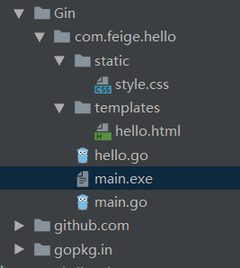
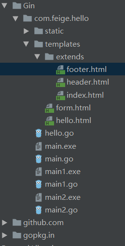

# 1、Gin框架介绍


`Gin`是一个用Go语言编写的web框架。它是一个类似于`martini`但拥有更好性能的API框架, 由于使用了`httprouter`，速度提高了近40倍。 如果你是性能和高效的追求者, 你会爱上`Gin`。

Go世界里最流行的Web框架，[Github](https://github.com/gin-gonic/gin)上有`32K+`star。 基于[httprouter](https://github.com/julienschmidt/httprouter)开发的Web框架。 [中文文档](https://gin-gonic.com/zh-cn/docs/)齐全，简单易用的轻量级框架。

# 2、Gin的特性

## 快速

基于 Radix 树的路由，小内存占用。没有反射。可预测的 API 性能。

## 支持中间件

传入的 HTTP 请求可以由一系列中间件和最终操作来处理。 例如：Logger，Authorization，GZIP，最终操作 DB。

## Crash 处理

Gin 可以 catch 一个发生在 HTTP 请求中的 panic 并 recover 它。这样，你的服务器将始终可用。例如，你可以向 Sentry 报告这个 panic！

## JSON 验证

Gin 可以解析并验证请求的 JSON，例如检查所需值的存在。

## 路由组

更好地组织路由。是否需要授权，不同的 API 版本…… 此外，这些组可以无限制地嵌套而不会降低性能。

## 错误管理

Gin 提供了一种方便的方法来收集 HTTP 请求期间发生的所有错误。最终，中间件可以将它们写入日志文件，数据库并通过网络发送。

## 内置渲染

Gin 为 JSON，XML 和 HTML 渲染提供了易于使用的 API。

## 可扩展性

新建一个中间件非常简单。

# 3、Gin的安装和使用

## 安装

要安装 Gin 软件包，需要先安装 Go 并设置 Go 工作区。

1.下载并安装 gin：

```sh
$ go get -u github.com/gin-gonic/gin
```

下载需要很长时间，大家要耐心等待

2.将 gin 引入到代码中：

```go
import "github.com/gin-gonic/gin"
```

3.（可选）如果使用诸如 `http.StatusOK` 之类的常量，则需要引入 `net/http` 包：

```go
import "net/http"
```

## 使用

~~~go
package main

import "github.com/gin-gonic/gin"

func main() {
    //创建一个默认的路由引擎
	engine := gin.Default()
    // GET：请求方式；/hello：请求的路径
	// 当客户端以GET方法请求/feige路径时，会执行后面的匿名函数
	engine.GET("/feige", func(context *gin.Context) {
        //以JSON的格式返回数据
		context.JSON(200,gin.H{
			"message":"feige",
		})
	})
    //启动HTTP服务，默认在0.0.0.0:8080启动服务
	_ = engine.Run()
}
~~~

在浏览器中输入http://localhost:8080/feige就可看到返回

```json
{"message":"feige"}
```

# 4、在Gin中是用HTML模板

~~~css
.hello{
    color: red;
    font-weight: bolder;
    background: #7f7f7f;
}
~~~


~~~html
{{/*定义一个go模板*/}}
{{ define "feige/hello.html" }}
<!DOCTYPE html>
<html lang="en">
<head>
    <meta charset="UTF-8">
    <title>hello</title>
    <link rel="stylesheet" href="../static/style.css">
</head>
<body>
{{/*{{ .title }}将被替换为title的value，.代表当前对象*/}}
    <h1 class="hello">{{ .title }}</h1>
</body>
</html>
{{/*一定不要忘记结束*/}}
{{ end }}
~~~


~~~go
package main

import "github.com/gin-gonic/gin"

func main() {
	engine := gin.Default()
    //加载静态文件，css，js，img等
    //第一个参数是通过路由访问时的路径，第二是该目录的相对路径或绝对路径
    //http://localhost:8080/static/style.css
	engine.Static("/static","./static")
    //加载模板（加载多个）
	engine.LoadHTMLGlob("templates/*")
	engine.GET("/feige/hello", func(context *gin.Context) {
		context.HTML(200,"feige/hello.html",gin.H{
            //模板中{{ .title }}将被替换为feige
			"title":"feige",
		})
	})
	_ = engine.Run(":8080")
}
~~~

我们可以通过 LoadHTMLGlob 和 LoadHTMLFiles 两个方法来对我们的模板进行加载。其中 LoadHTMLGlob 方法可以将一个目录下所有的模板进行加载，而LoadHTMLFiles只会加载一个文件，他的参数为可变长参数，需要我们一个一个的手动将模板文件填写。这里我们使用 LoadHTMLGlob 方法

整个项目的目录结构




# 5、获取参数

## 5.1、获取querystring参数

`querystring`指的是URL中`?`后面携带的参数，例如：`/feige/hello?username=feige&age=19`。 获取请求的querystring参数的方法如下：

```go
package main

import (
   "github.com/gin-gonic/gin"
   "net/http"
)

func main() {
   engine := gin.Default()
   engine.GET("/feige/hello", func(context *gin.Context) {
      //第一个参数是key，第二参数是默认值，当没有传入参数时，value为默认值
      //username := context.DefaultQuery("username","feige")
      //没有默认值，当没有传入该参数时，value为空
      username := context.Query("username")
      age := context.DefaultQuery("age","19")
      context.JSON(http.StatusOK,gin.H{
         "username":username,
         "age":age,
      })
   })
   _ = engine.Run()
}
```

# 5.2、获取form参数

~~~html
{{ define "/feige/form.html"}}

<!DOCTYPE html>
<html lang="en">
<head>
    <meta charset="UTF-8">
    <title>form</title>
</head>
<body>
<form action="/feige/posts" method="post">
    username:<input type="text" name="username">
    age:<input type="number" name="age">
    <input type="submit" value="提交">
</form>
</body>
</html>

{{ end }}
~~~


```go
package main

import (
   "fmt"
   "github.com/gin-gonic/gin"
   "net/http"
)

func main()  {
   engine := gin.Default()
   engine.POST("feige/posts", func(context *gin.Context) {
      //第一个参数是key，第二参数是默认值，当没有传入参数时，value为默认值
      username := context.DefaultPostForm("username","feige")
      //没有默认值，当没有传入该参数时，value为空
      age := context.PostForm("age")
      fmt.Println(username,age)
      context.JSON(http.StatusOK,gin.H{
         "username":username,
         "age":age,
      })
   })
   engine.LoadHTMLGlob("./templates/*")
   engine.GET("/feige/hello", func(context *gin.Context) {
      context.HTML(http.StatusOK,"/feige/form.html",gin.H{})
   })
   _ = engine.Run()
}
```

## 5.3、获取path中的参数

请求的参数通过URL路径传递

```go
package main

import (
   "fmt"
   "github.com/gin-gonic/gin"
   "net/http"
)

func main()  {
   engine := gin.Default()
   engine.GET("/feige/hello/:username", func(context *gin.Context) {
      username := context.Param("username")
      context.JSON(http.StatusOK,gin.H{
         "username": username,
      })
   })
   _ = engine.Run()
}
```

# 6、模板继承

header.html

~~~html
{{ define "header"}}
<!DOCTYPE html>
<html lang="en">
<head>
    <meta charset="UTF-8">
    <title>feige</title>
</head>
<body>

{{ end }}  
~~~

footer.html

~~~html
{{ define "footer" }}
</body>
</html>

{{ end }}
~~~

index.html

~~~html
{{ define "/feige/index.html" }}
    {{ template "header" }}
    <h1>{{ .msg }}</h1>
    {{ template "footer" }}
{{ end }}
~~~


~~~go
package main

import (
	"github.com/gin-gonic/gin"
	"net/http"
)

func main() {
	engine := gin.Default()
	engine.LoadHTMLGlob("templates/*/*")
	engine.GET("/feige/hello", func(context *gin.Context) {
		context.HTML(http.StatusOK,"/feige/index.html",gin.H{
			"msg":"feige",
		})
	})

	_ = engine.Run()
}

~~~

**demo的目录结构**



# 7、上传文件

## 7.1、单个文件上传

~~~html
{{ define "/feige/extends/upload.html"}}

    <!DOCTYPE html>
    <html lang="en">
    <head>
        <meta charset="UTF-8">
        <title>form</title>
    </head>
    <body>
       {{/*不要忘记enctype="multipart/form-data"*/}}
    <form action="/feige/upload" method="post" enctype="multipart/form-data">
        <input type="file" name="file">
        <input type="submit" value="提交">
    </form>
    </body>
    </html>

{{ end }}
~~~


```go
package main

import (
   "github.com/gin-gonic/gin"
   "log"
   "net/http"
)

func main() {
   engine := gin.Default()
   engine.LoadHTMLGlob("./templates/*/*")
   engine.GET("/feige/hello", func(context *gin.Context) {
      context.HTML(http.StatusOK,"/feige/extends/upload.html",gin.H{})
   })
   engine.POST("/feige/upload", func(context *gin.Context) {
      file, err := context.FormFile("file")
      if err != nil {
         context.JSON(http.StatusInternalServerError, gin.H{
            "msg": err.Error(),
         })
         return
      }
      fileName := file.Filename
      log.Println(fileName)
       //第一个参数是文件，第二个参数文件要的存放目录
      _ = context.SaveUploadedFile(file,"./test/"+fileName)
      context.JSON(http.StatusOK,gin.H{
         "msg":"上传成功",
      })
   })
   _ = engine.Run()
}
```

## 7.2、多个文件上传

upload.html

~~~html
{{ define "/feige/extends/upload.html"}}

    <!DOCTYPE html>
    <html lang="en">
    <head>
        <meta charset="UTF-8">
        <title>form</title>
    </head>
    <body>
    <form action="/feige/upload" method="post" enctype="multipart/form-data">
        <input type="file" name="files">
        <input type="file" name="files">
        <input type="submit" value="提交">
    </form>
    </body>
    </html>

{{ end }}
~~~


```go
package main

import (
   "fmt"
   "github.com/gin-gonic/gin"
   "log"
   "net/http"
)

func main() {
   engine := gin.Default()
   engine.LoadHTMLGlob("./templates/*/*")
   engine.GET("/feige/hello", func(context *gin.Context) {
      context.HTML(http.StatusOK,"/feige/extends/upload.html",gin.H{})
   })
   engine.POST("/feige/upload", func(context *gin.Context) {
      form, err := context.MultipartForm()
      fmt.Println(form)
      if err != nil {
         context.JSON(http.StatusInternalServerError, gin.H{
            "msg": err.Error(),
         })
         return
      }
      files := form.File["files"]
      fmt.Println(files)
      for _, file := range files  {
         log.Println(file.Filename)
         fmt.Println(file.Filename)
         fileName := file.Filename
         _ = context.SaveUploadedFile(file, "./test/"+fileName)
      }
      context.JSON(http.StatusOK, gin.H{
         "msg": "上传成功",
      })
   })
   _ = engine.Run()
}
```

# 8、重定向

```go
package main

import (
   "fmt"
   "github.com/gin-gonic/gin"
   "log"
   "net/http"
)

func main() {
   engine := gin.Default()
   engine.LoadHTMLGlob("./templates/*/*")
   engine.GET("/feige/hello", func(context *gin.Context) {
      //外部重定向
      //context.Redirect(http.StatusPermanentRedirect,"https://www.pyfeige.com/first")
      //内部重定向
      //context.Redirect(http.StatusPermanentRedirect,"/hello")
      // 指定重定向的URL
      context.Request.URL.Path = "/hello"
      engine.HandleContext(context)
      context.HTML(http.StatusOK,"/feige/extends/upload.html",gin.H{})
   })
   engine.GET("/hello", func(context *gin.Context) {
      context.HTML(http.StatusOK,"/feige/extends/upload.html",gin.H{
         "msg":"重定向成功",
      })
   })
   _ = engine.Run()
}
```

# 9、路由

```go
//匹配任何请求方式
engine.Any("/hello/feige", func(context *gin.Context) {
   
})
```

```go
//当没有匹配到路由时调用
engine.NoRoute(func(context *gin.Context) {
   context.HTML(http.StatusNotFound,"/feige/404.html",nil)
})
```

**路由组**

```go
group := engine.Group("user")
{
   group.GET("get_user", func(context *gin.Context) {
      
   })
   group.POST("add_user",func(context *gin.Context) {

})
   group.PUT("update_user",func(context *gin.Context) {

})
   group.DELETE("delete_user",func(context *gin.Context) {

})
}
```

**路由嵌套**

```go
group := engine.Group("user")
	{
		group.GET("get_user", func(context *gin.Context) {
	})
		group1 := engine.Group("feige")
		group1.Any("/all", func(context *gin.Context) {
	})
		group.POST("add_user",func(context *gin.Context) {
	})
		group.PUT("update_user",func(context *gin.Context) {
	})
		group.DELETE("delete_user",func(context *gin.Context) {
	})	
	}
```