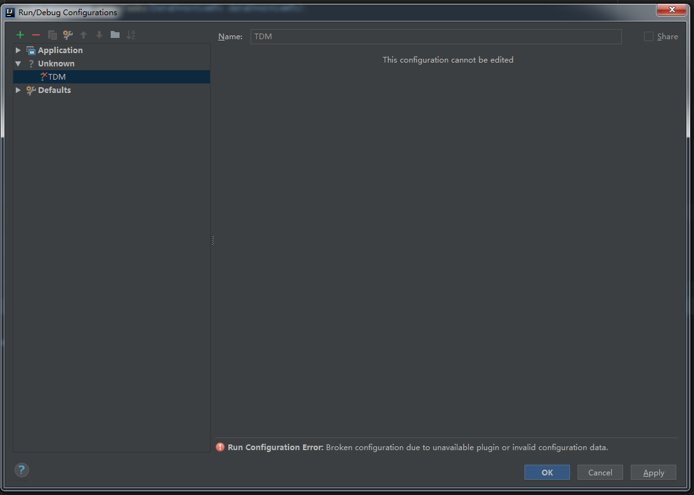
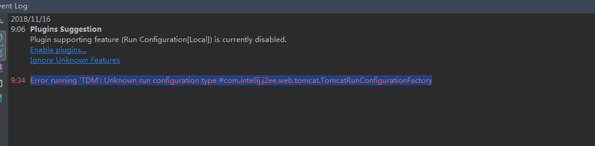
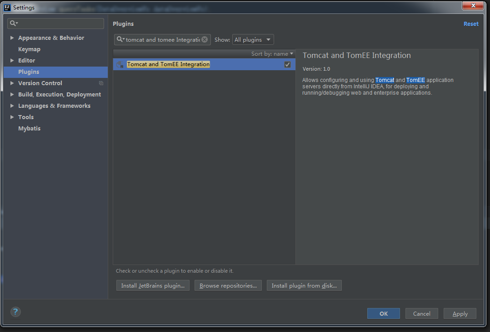
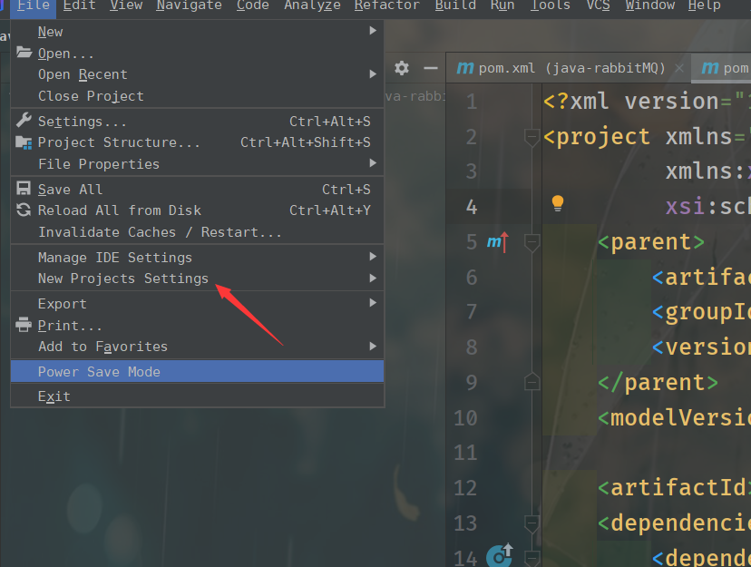
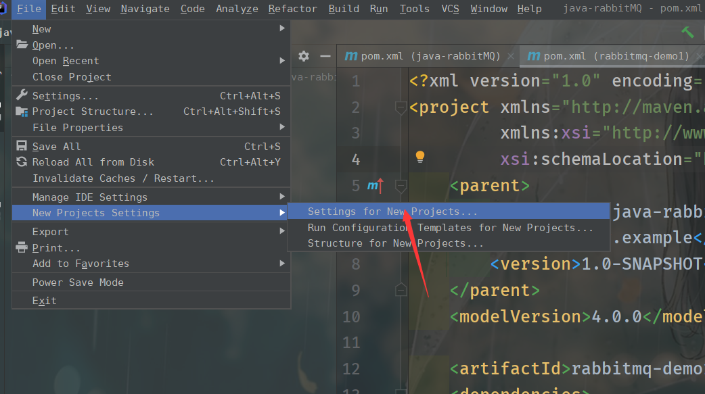
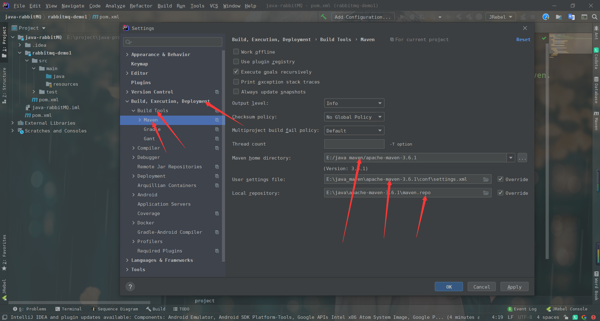

## IDEA的一些常用操作

把jar包增加到com中->add labrary as

增加容器支持->add frameworks support

标记目录类型->mark directory as ->resources root(配置源文件)、source root(java源代码文件)、test recourses root（测试文件）

快捷键：ctrl+insert(快速写入构造方法和get、set方法等)、alt+enter（代码补齐）

环境问题：当包没在时（项目结构->Artifacts->新建一个lib文件把包导入到lib里）

## [IDEA启动异常或者IDEA配置Tomcat插件异常](https://www.cnblogs.com/blogslee/p/9967492.html)

### 问题描述：

1.配置信息：Run Configuration Error: Broken configuration due to unavailable plugin or invalid configuration data.

2.idea运行异常信息：

Error running 'TDM': Unknown run configuration type #com.intellij.j2ee.web.tomcat.TomcatRunConfigurationFactory

### 解决方案：

1.检查IDEA插件是否下载

2.在IDEA--PLUGIN中检查tomcat and tomee Integration是否勾选（必须勾选，才能实现idea以tomcat方式配置和启动）

点击enable

 最后一步：重启IDEA即可

# idea自定义配置maven，永久

C:\Users\feige\.IntelliJIdea2019.3\config\options\project.default.xml

~~~xml
<application>
  <component name="ProjectManager">
    <defaultProject>
      <component name="MavenImportPreferences">
        <option name="generalSettings">
          <MavenGeneralSettings>
            <option name="localRepository" value="E:\java\apache-maven-3.6.1\maven.repo"/>
            <option name="mavenHome" value="E:/java_maven/apache-maven-3.6.1"/>
            <option name="useSettingsFile" value="E:\java_maven\apache-maven-3.6.1\conf\settings.xml"/>
          </MavenGeneralSettings>
        </option>
      </component>
       ......
~~~

# idea安装uniapp语法提示

~~~shell
npm i @dcloudio/types -D
~~~

