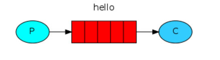

# 1、RabbitMQ安装

[官网](https://www.rabbitmq.com/)

docker安装

~~~bash
docker run -it --rm --name rabbitmq -p 5672:5672 -p 15672:15672 rabbitmq:3-management
~~~

访问rabbitmq web管理界面 http://ip:15672

用户名：guest

密码：guest

显示下边页面则安装成功

# 2、创建虚拟主机和用户

便于维护，我们给每一个项目设置一个虚拟主机和用户，（相当于一个项目对应一个数据库）

## 创建虚拟主机

## 创建用户并绑定虚拟主机

# 3、Java整合rabbitmq

引入jar包

~~~xml
<!-- https://mvnrepository.com/artifact/com.rabbitmq/amqp-client -->
<dependency>
    <groupId>com.rabbitmq</groupId>
    <artifactId>amqp-client</artifactId>
    <version>5.7.3</version>
</dependency>
~~~

## helloworld模型

生产者将消息发送到“ hello”队列。使用者从该队列接收消息。

~~~java
package com.feige.utils;

import com.rabbitmq.client.Channel;
import com.rabbitmq.client.Connection;
import com.rabbitmq.client.ConnectionFactory;

import java.io.IOException;
import java.util.concurrent.TimeoutException;

/**
 * @author feige
 */
public class RabbitMqUtils {

    public static Connection getConnect() {
        ConnectionFactory connectionFactory = new ConnectionFactory();
        connectionFactory.setHost("47.108.155.85");
        connectionFactory.setPort(5672);
        connectionFactory.setVirtualHost("/xiaofei");
        connectionFactory.setUsername("feige");
        connectionFactory.setPassword("123456");
        try {
            return connectionFactory.newConnection();
        } catch (Exception e) {
            e.printStackTrace();
        }
        return null;
    }

    public static void close(Connection connection, Channel channel){
        if (channel != null) {
            try {
                channel.close();
            } catch (IOException e) {
                e.printStackTrace();
            } catch (TimeoutException e) {
                e.printStackTrace();
            }
        }
        if (connection != null) {
            try {
                connection.close();
            } catch (IOException e) {
                e.printStackTrace();
            }
        }
    }
}

~~~

~~~java
package com.feige.helloworld;

import com.feige.utils.RabbitMqUtils;
import com.rabbitmq.client.Channel;
import com.rabbitmq.client.Connection;
import com.rabbitmq.client.MessageProperties;

import java.io.IOException;

/**
 * @author feige
 */
public class Provider {

    public static void main(String[] args) throws IOException {
        Connection connection = RabbitMqUtils.getConnect();
        // 创建一个channel
        assert connection != null;
        Channel channel = connection.createChannel();
        /*
        通道绑定对应的消息队列
        参数一：队列名称，如何队列不存在则自动创建
        参数二：队列是否持久化，true为持久化，rabbitmq重启之后队列还存在
        参数三：是否独占队列，true为是
        参数四：是否在消费完后自动删除队列，true自动删除
        参数五：额外参数
         */
        channel.queueDeclare("hello", false, false, false, null);
        /*
        发布消息
        参数一：交换机名称
        参数二：队列名称
        参数三：传递消息额外设置 MessageProperties.PERSISTENT_TEXT_PLAIN 持久化
        参数四：消息具体内容
         */
        channel.basicPublish("", "hello", MessageProperties.PERSISTENT_TEXT_PLAIN, "hello world2".getBytes());
        RabbitMqUtils.close(connection, channel);
    }
}

~~~

~~~java
package com.feige.helloworld;

import com.feige.utils.RabbitMqUtils;
import com.rabbitmq.client.*;

import java.io.IOException;

/**
 * @author feige
 */
public class Consumer {
    public static void main(String[] args) throws IOException {
        Connection connection = RabbitMqUtils.getConnect();
        // 创建一个channel
        assert connection != null;
        Channel channel = connection.createChannel();
        /*
        通道绑定对应的消息队列
        参数一：队列名称，如何队列不存在则自动创建
        参数二：队列是否持久化，true为持久化，rabbitmq重启之后队列还存在
        参数三：是否独占队列，true为是
        参数四：是否在消费完后自动删除队列，true自动删除
        参数五：额外参数
         */
        channel.queueDeclare("hello", false, false, false, null);
        channel.basicConsume("hello",true,new DefaultConsumer(channel){
            @Override
            public void handleDelivery(String consumerTag, Envelope envelope, AMQP.BasicProperties properties, byte[] body) throws IOException {
                System.out.println(new String(body));
            }
        });
    }
}

~~~

## work模型

一个*工作队列*，该*队列*将用于在多个工作人员之间分配耗时的任务。

~~~java
package com.feige.workqueue;

import com.feige.utils.RabbitMqUtils;
import com.rabbitmq.client.Channel;
import com.rabbitmq.client.Connection;

import java.io.IOException;

/**
 * @author feige
 */
public class Provider {
    public static void main(String[] args) throws IOException {
        Connection connect = RabbitMqUtils.getConnect();
        assert connect != null;
        Channel channel = connect.createChannel();
        channel.queueDeclare("work",false,false,false,null);
        for (int i = 0; i < 10; i++) {
            channel.basicPublish("","work",null,("hello word queue" + i).getBytes());
        }
        RabbitMqUtils.close(connect,channel);
    }
}

~~~

~~~java
package com.feige.workqueue;

import com.feige.utils.RabbitMqUtils;
import com.rabbitmq.client.*;

import java.io.IOException;

/**
 * @author feige
 */
public class Consumer1 {

    public static void main(String[] args) throws IOException {
        Connection connect = RabbitMqUtils.getConnect();

        assert connect != null;
        Channel channel = connect.createChannel();
        channel.queueDeclare("work",false,false,false,null);
        channel.basicConsume("work",true,new DefaultConsumer(channel){
            @Override
            public void handleDelivery(String consumerTag, Envelope envelope, AMQP.BasicProperties properties, byte[] body) throws IOException {
                System.out.println("消费者1" + new String(body));
            }
        });
    }
}

~~~

~~~java
package com.feige.workqueue;

import com.feige.utils.RabbitMqUtils;
import com.rabbitmq.client.*;

import java.io.IOException;

/**
 * @author feige
 */
public class Consumer2 {
    public static void main(String[] args) throws IOException {
        Connection connect = RabbitMqUtils.getConnect();

        assert connect != null;
        Channel channel = connect.createChannel();
        channel.queueDeclare("work",false,false,false,null);
        channel.basicConsume("work",true,new DefaultConsumer(channel){
            @Override
            public void handleDelivery(String consumerTag, Envelope envelope, AMQP.BasicProperties properties, byte[] body) throws IOException {
                System.out.println("消费者2" + new String(body));
            }
        });
    }
}

~~~

> 总结：默认情况下，RabbitMQ将按顺序将每个消息发送给下一个使用者。平均而言，每个消费者都会收到相同数量的消息。这种分发消息的方式称为循环。

### 能者多劳

~~~java
// 同一时刻服务器只会发一条消息给消费者
channel.basicQos(1);
channel.queueDeclare("work",false,false,false,null);
channel.basicConsume("work",false,new DefaultConsumer(channel){
    @Override
    public void handleDelivery(String consumerTag, Envelope envelope, AMQP.BasicProperties properties, byte[] body) throws IOException {
        try {
            Thread.sleep(2000);
        } catch (InterruptedException e) {
            e.printStackTrace();
        }
        System.out.println("消费者1" + new String(body));
        // 参数一：确认队列中那个具体消息 参数二：是否开启多个消息同时确认
        channel.basicAck(envelope.getDeliveryTag(),false);
    }
});
~~~

## 广播（fanout）

~~~java
package com.feige.fanout;

import com.feige.utils.RabbitMqUtils;
import com.rabbitmq.client.Channel;
import com.rabbitmq.client.Connection;

import java.io.IOException;

/**
 * @author feige
 */
public class Provider {

    public static void main(String[] args) throws IOException {
        Connection connect = RabbitMqUtils.getConnect();
        assert connect != null;
        Channel channel = connect.createChannel();
        channel.exchangeDeclare("myfanout","fanout",false,false,null);
        for (int i = 0; i < 100; i++) {
            channel.basicPublish("myfanout","work1",null,("hello word queue" + i).getBytes());
        }
        RabbitMqUtils.close(connect,channel);
    }
}

~~~

~~~java
package com.feige.fanout;

import com.feige.utils.RabbitMqUtils;
import com.rabbitmq.client.*;

import java.io.IOException;

/**
 * @author feige
 */
public class Consumer1 {

    public static void main(String[] args) throws IOException {
        Connection connect = RabbitMqUtils.getConnect();
        assert connect != null;
        final Channel channel = connect.createChannel();
        channel.queueDeclare("work1",false,false,false,null);
        channel.exchangeDeclare("myfanout","fanout",false,false,null);
        channel.queueBind("work1","myfanout","work");
        channel.basicConsume("work1",false,new DefaultConsumer(channel){
            @Override
            public void handleDelivery(String consumerTag, Envelope envelope, AMQP.BasicProperties properties, byte[] body) throws IOException {
                System.out.println("消费者1" + new String(body));
            }
        });
    }
}

~~~

~~~java
package com.feige.fanout;

import com.feige.utils.RabbitMqUtils;
import com.rabbitmq.client.*;

import java.io.IOException;

/**
 * @author feige
 */
public class Consumer2 {
    public static void main(String[] args) throws IOException {
        Connection connect = RabbitMqUtils.getConnect();

        assert connect != null;
        final Channel channel = connect.createChannel();
        channel.queueDeclare("work2",false,false,false,null);
        channel.exchangeDeclare("myfanout","fanout",false,false,null);
        channel.queueBind("work2","myfanout","work");
        channel.basicConsume("work2",true,new DefaultConsumer(channel){
            @Override
            public void handleDelivery(String consumerTag, Envelope envelope, AMQP.BasicProperties properties, byte[] body) throws IOException {
                System.out.println("消费者2" + new String(body));
            }
        });
    }
}

~~~

## 直连（direct）

~~~java
package com.feige.direct;

import com.feige.utils.RabbitMqUtils;
import com.rabbitmq.client.Channel;
import com.rabbitmq.client.Connection;

import java.io.IOException;

/**
 * @author feige
 */
public class Provider {

    public static void main(String[] args) throws IOException {
        Connection connect = RabbitMqUtils.getConnect();
        assert connect != null;
        Channel channel = connect.createChannel();
        channel.queueDeclare("work",false,false,false,null);
        channel.exchangeDeclare("mydirect","direct",false,false,null);
        channel.queueBind("work","mydirect","directRouting");
        for (int i = 0; i < 100; i++) {
            channel.basicPublish("mydirect","directRouting",null,("hello word queue" + i).getBytes());
        }
        RabbitMqUtils.close(connect,channel);
    }
}

~~~

~~~java
package com.feige.direct;

import com.feige.utils.RabbitMqUtils;
import com.rabbitmq.client.*;

import java.io.IOException;

/**
 * @author feige
 */
public class Consumer1 {

    public static void main(String[] args) throws IOException {
        Connection connect = RabbitMqUtils.getConnect();
        assert connect != null;
        final Channel channel = connect.createChannel();
        channel.queueDeclare("work",false,false,false,null);
        channel.exchangeDeclare("mydirect","direct",false,false,null);
        channel.queueBind("work","mydirect","directRouting");
        channel.basicConsume("work",false,new DefaultConsumer(channel){
            @Override
            public void handleDelivery(String consumerTag, Envelope envelope, AMQP.BasicProperties properties, byte[] body) throws IOException {
                System.out.println("消费者1" + new String(body));
            }
        });
    }
}

~~~

~~~java
package com.feige.direct;

import com.feige.utils.RabbitMqUtils;
import com.rabbitmq.client.*;

import java.io.IOException;

/**
 * @author feige
 */
public class Consumer1 {

    public static void main(String[] args) throws IOException {
        Connection connect = RabbitMqUtils.getConnect();
        assert connect != null;
        final Channel channel = connect.createChannel();
        channel.queueDeclare("work",false,false,false,null);
        channel.exchangeDeclare("mydirect","direct",false,false,null);
        channel.queueBind("work","mydirect","directRouting");
        channel.basicConsume("work",false,new DefaultConsumer(channel){
            @Override
            public void handleDelivery(String consumerTag, Envelope envelope, AMQP.BasicProperties properties, byte[] body) throws IOException {
                System.out.println("消费者1" + new String(body));
            }
        });
    }
}

~~~

## 主题（topic）

~~~java
package com.feige.topic;

import com.feige.utils.RabbitMqUtils;
import com.rabbitmq.client.Channel;
import com.rabbitmq.client.Connection;

import java.io.IOException;

/**
 * @author feige
 */
public class Provider {

    public static void main(String[] args) throws IOException {
        Connection connect = RabbitMqUtils.getConnect();
        assert connect != null;
        Channel channel = connect.createChannel();
        channel.queueDeclare("work1",false,false,false,null);
        channel.queueDeclare("work2",false,false,false,null);
        channel.exchangeDeclare("mytopic","topic",false,false,null);
        channel.queueBind("work1","mytopic","topicRouting.one");
        channel.queueBind("work2","mytopic","topicRouting.#");
        for (int i = 0; i < 100; i++) {
            channel.basicPublish("mytopic","topicRouting.one",null,("hello word queue" + i).getBytes());
        }
        RabbitMqUtils.close(connect,channel);
    }
}

~~~

~~~java
package com.feige.topic;

import com.feige.utils.RabbitMqUtils;
import com.rabbitmq.client.*;

import java.io.IOException;

/**
 * @author feige
 */
public class Consumer1 {

    public static void main(String[] args) throws IOException {
        Connection connect = RabbitMqUtils.getConnect();
        assert connect != null;
        final Channel channel = connect.createChannel();
        channel.queueDeclare("work1",false,false,false,null);
        channel.exchangeDeclare("mytopic","topic",false,false,null);
        channel.queueBind("work1","mytopic","topicRouting.one");
        channel.basicConsume("work1",true,new DefaultConsumer(channel){
            @Override
            public void handleDelivery(String consumerTag, Envelope envelope, AMQP.BasicProperties properties, byte[] body) throws IOException {
                System.out.println("消费者1" + new String(body));
            }
        });
    }
}

~~~

~~~java
package com.feige.topic;

import com.feige.utils.RabbitMqUtils;
import com.rabbitmq.client.*;

import java.io.IOException;

/**
 * @author feige
 */
public class Consumer2 {
    public static void main(String[] args) throws IOException {
        Connection connect = RabbitMqUtils.getConnect();

        assert connect != null;
        final Channel channel = connect.createChannel();
        channel.queueDeclare("work2",false,false,false,null);
        channel.exchangeDeclare("mytopic","topic",false,false,null);
        channel.queueBind("work2","mytopic","topicRouting.#");
        channel.basicConsume("work2",true,new DefaultConsumer(channel){
            @Override
            public void handleDelivery(String consumerTag, Envelope envelope, AMQP.BasicProperties properties, byte[] body) throws IOException {
                System.out.println("消费者2" + new String(body));
            }
        });
    }
}

~~~

