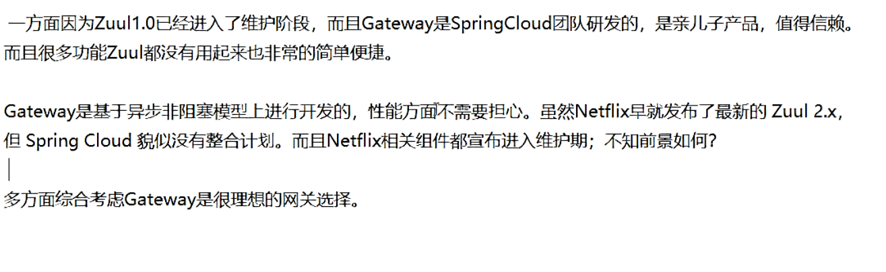
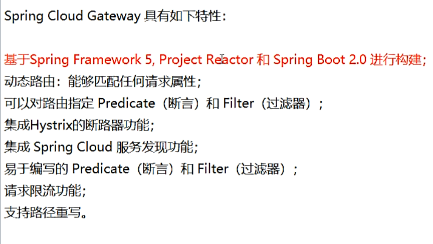
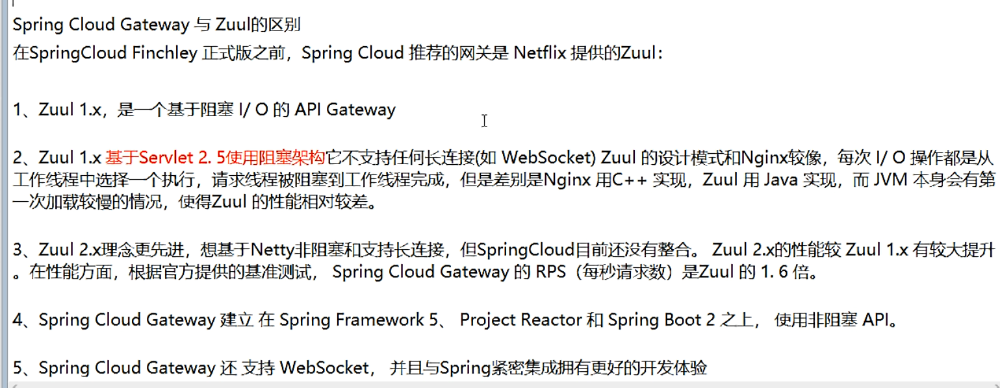
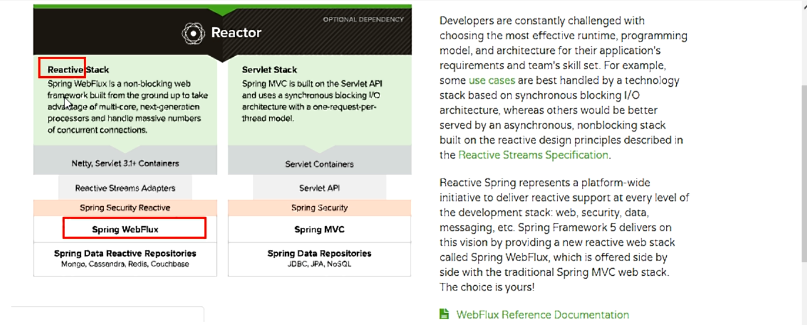
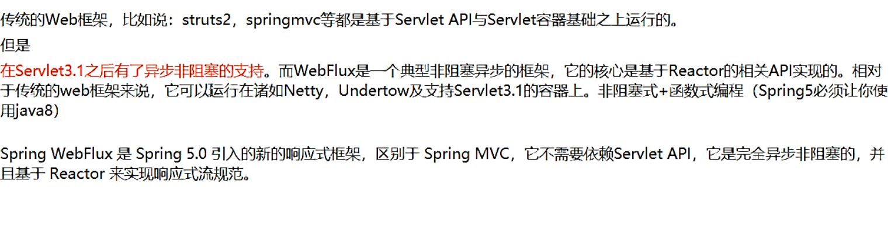
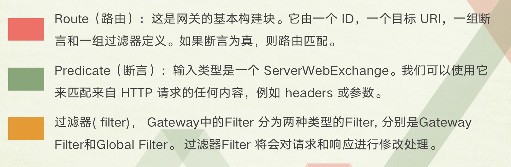
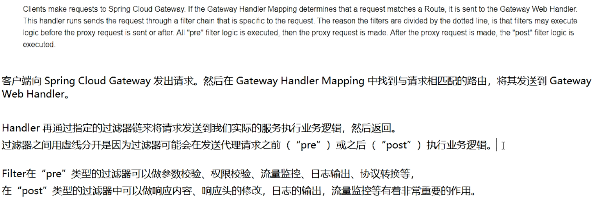
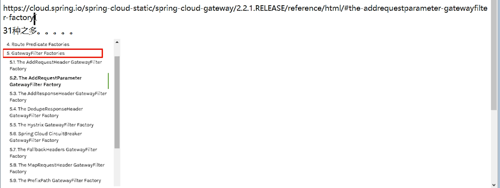
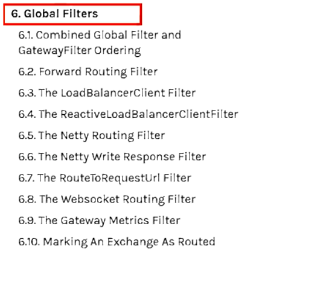

# 1、Gateway

[官网地址](https://cloud.spring.io/spring-cloud-static/spring-cloud-gateway/2.2.1.RELEASE/reference/html/)

>  **API网关的定义**

网关的角色是作为一个 API 架构，用来保护、增强和控制对于 API 服务的访问。

API 网关是一个处于应用程序或服务（提供 REST API 接口服务）之前的系统，用来管理授权、访问控制和流量限制等，这样 REST API 接口服务就被 API 网关保护起来，对所有的调用者透明。因此，隐藏在 API 网关后面的业务系统就可以专注于创建和管理服务，而不用去处理这些策略性的基础设施。

>  **API网关的职能**

Gateway能做什么

- 反向代理
- 日志监控
- 鉴权
- 流量控制
- 熔断
- 。。。

>  **微服务中网关在哪里**

>  **为什么我们用Gateway而不用Zuul**

>  **Zuul1.x模型**

> **WebFlux是什么**

> **Gateway的三大核心概念**

> **Gateway的工作流程**

**核心逻辑：路由转发+执行过滤器链**

# 2、Gateway入门

## 2.1、示例

**请参考Eureka这篇博客，里面有完整的项目结构**

**新建一个cloud-gateway-gateway9527模块**

pom.xml

~~~xml
<?xml version="1.0" encoding="UTF-8"?>
<project xmlns="http://maven.apache.org/POM/4.0.0"
         xmlns:xsi="http://www.w3.org/2001/XMLSchema-instance"
         xsi:schemaLocation="http://maven.apache.org/POM/4.0.0 http://maven.apache.org/xsd/maven-4.0.0.xsd">
    <parent>
        <artifactId>springcloud</artifactId>
        <groupId>com.feige</groupId>
        <version>1.0-SNAPSHOT</version>
    </parent>
    <modelVersion>4.0.0</modelVersion>

    <artifactId>cloud-gateway-gateway9527</artifactId>

    <dependencies>
        <!--新增gateway-->
        <dependency>
            <groupId>org.springframework.cloud</groupId>
            <artifactId>spring-cloud-starter-gateway</artifactId>
        </dependency>
        <dependency>
            <groupId>com.feige</groupId>
            <artifactId>cloud-api-commons</artifactId>
            <version>1.0-SNAPSHOT</version>
        </dependency>

        <dependency>
            <groupId>org.springframework.cloud</groupId>
            <artifactId>spring-cloud-starter-netflix-hystrix</artifactId>
        </dependency>
        <dependency>
            <groupId>org.springframework.cloud</groupId>
            <artifactId>spring-cloud-starter-netflix-eureka-client</artifactId>
        </dependency>

        <dependency>
            <groupId>org.springframework.boot</groupId>
            <artifactId>spring-boot-devtools</artifactId>
            <scope>runtime</scope>
            <optional>true</optional>
        </dependency>

        <dependency>
            <groupId>org.projectlombok</groupId>
            <artifactId>lombok</artifactId>
            <optional>true</optional>
        </dependency>
        <dependency>
            <groupId>org.springframework.boot</groupId>
            <artifactId>spring-boot-starter-test</artifactId>
            <scope>test</scope>
        </dependency>
    </dependencies>

</project>
~~~

application.yaml

~~~yaml
server:
  port: 9527
spring:
  application:
    name: cloud-gateway
  cloud:
    gateway:
      routes:
        - id: payment_routh #路由的ID，没有固定规则但要求唯一，建议配合服务名
          #uri: http://localhost:8001   #匹配后提供服务的路由地址
          #lb://serviceName是spring cloud gateway在微服务中自动为我们创建的负载均衡uri
          uri: lb://cloud-payment-service #uri的协议为lb，表示启用Gateway的负载均衡功能。
          predicates:
            - Path=/payment/get/**   #断言,路径相匹配的进行路由

        - id: payment_routh2
          #uri: http://localhost:8001
          uri: lb://cloud-payment-service #uri的协议为lb，表示启用Gateway的负载均衡功能。
          predicates:
            - Path=/payment/lb/**   #断言,路径相匹配的进行路由

eureka:
  instance:
    hostname: cloud-gateway-service
  client:
    service-url:
      register-with-eureka: true
      fetch-registry: true
      defaultZone: http://eureka7001.com:7001/eureka

~~~

**主启动类**

GatewayApplication9527.java

~~~~java
package com.feige;

import org.springframework.boot.SpringApplication;
import org.springframework.boot.autoconfigure.SpringBootApplication;
import org.springframework.cloud.netflix.eureka.EnableEurekaClient;

@SpringBootApplication
@EnableEurekaClient
public class GatewayApplication9527 {

    public static void main(String[] args) {
        SpringApplication.run(GatewayApplication9527.class,args);
    }
}

~~~~

> 测试

启动Eureka7001，服务提供者8001和8002、服务网关9257

添加网关前：http://localhost:8001/payment/get/31

添加网关后：http://localhost:9257/payment/get/31

> 访问百度国际新闻

第一种方式：yaml方式

第二种方式：代码中注入RouteLocator的Bean

GatewayConfig.java

~~~java
package com.feige.config;

import org.springframework.cloud.gateway.route.RouteLocator;
import org.springframework.cloud.gateway.route.builder.RouteLocatorBuilder;
import org.springframework.context.annotation.Bean;
import org.springframework.context.annotation.Configuration;

@Configuration
public class GatewayConfig {

    @Bean
    public RouteLocator getRouteLocator(RouteLocatorBuilder routeLocatorBuilder){
        RouteLocatorBuilder.Builder routes = routeLocatorBuilder.routes();
        routes.route("feige", r -> r.path("/guoji").uri("http://news.baidu.com/guoji")).build();
        return routes.build();
    }
}

~~~

测试：http://localhost:9257/guoji

## 2.2、Predicate

### 通过时间匹配

Predicate 支持设置一个时间，在请求进行转发的时候，可以通过判断在这个时间之前或者之后进行转发。

~~~yaml
spring:
  cloud:
    gateway:
      routes:
       - id: payment_routh 
          uri: lb://cloud-payment-service #uri的协议为lb，表示启用Gateway的负载均衡功能。
          predicates:
            - After=2020-05-31T15:02:23.233+08:00[Asia/Shanghai]
~~~

Spring 是通过 ZonedDateTime 来对时间进行的对比，ZonedDateTime 是 Java 8 中日期时间功能里，用于表示带时区的日期与时间信息的类，ZonedDateTime 支持通过时区来设置时间，中国的时区是：Asia/Shanghai。

Before Route Predicate 刚好相反，在某个时间之前的请求的请求都进行转发。我们把上面路由规则中的 After 改为 Before，如下：

~~~~yaml
spring:
  cloud:
    gateway:
      routes:
       - id: payment_routh 
          uri: lb://cloud-payment-service #uri的协议为lb，表示启用Gateway的负载均衡功能。
          predicates:
            - Before=2020-05-31T15:02:23.233+08:00[Asia/Shanghai],2020-05-31T15:02:54.883+08:00[Asia/Shanghai]
~~~~

除过在时间之前或者之后外，Gateway 还支持限制路由请求在某一个时间段范围内，可以使用 Between Route Predicate 来实现。

~~~yaml
spring:
  cloud:
    gateway:
      routes:
       - id: payment_routh 
          uri: lb://cloud-payment-service #uri的协议为lb，表示启用Gateway的负载均衡功能。
          predicates:
            - Between=2020-05-31T15:02:54.883+08:00[Asia/Shanghai]
~~~

### 通过 Cookie 匹配

Cookie Route Predicate 可以接收两个参数，一个是 Cookie name , 一个是正则表达式，路由规则会通过获取对应的 Cookie name 值和正则表达式去匹配，如果匹配上就会执行路由，如果没有匹配上则不执行。

~~~yaml
spring:
  cloud:
    gateway:
      routes:
       - id: payment_routh 
          uri: lb://cloud-payment-service #uri的协议为lb，表示启用Gateway的负载均衡功能。
          predicates:
            - Cookie=username,feige
~~~

使用 curl 测试，命令行输入:

~~~bash
curl http://localhost:9527 --cookie "username=feige"
~~~

则会返回页面代码，如果去掉`--cookie "username=feige"`，后台汇报 404 错误。

### 通过Header匹配

Header Route Predicate 和 Cookie Route Predicate 一样，也是接收 2 个参数，一个 header 中属性名称和一个正则表达式，这个属性值和正则表达式匹配则执行。

~~~~yaml
spring:
  cloud:
    gateway:
      routes:
       - id: payment_routh 
          uri: lb://cloud-payment-service #uri的协议为lb，表示启用Gateway的负载均衡功能。
          predicates:
            - Header=X-Request-Id, \d+
 
~~~~

~~~bash
curl http://localhost:9527  -H "X-Request-Id:6666" 
~~~

则返回页面代码证明匹配成功。将参数`-H "X-Request-Id:666"`改为`-H "X-Request-Id:feige"`再次执行时返回 404 证明没有匹配。

### 通过 Host 匹配

Host Route Predicate 接收一组参数，一组匹配的域名列表，这个模板是一个 ant 分隔的模板，用.号作为分隔符。它通过参数中的主机地址作为匹配规则。

~~~yaml
spring:
  cloud:
    gateway:
      routes:
       - id: payment_routh 
          uri: lb://cloud-payment-service #uri的协议为lb，表示启用Gateway的负载均衡功能。
          predicates:
            - Host=**.feige.run
~~~

使用 curl 测试，命令行输入:

~~~bash
curl http://localhost:9527  -H "Host: www.feige.run" 
curl http://localhost:9527  -H "Host: md..feige.run" 
~~~

经测试以上两种 host 均可匹配到 host_route 路由，去掉 host 参数则会报 404 错误。

### 通过请求方式匹配

可以通过是 POST、GET、PUT、DELETE 等不同的请求方式来进行路由。

~~~yaml
spring:
  cloud:
    gateway:
      routes:
       - id: payment_routh 
          uri: lb://cloud-payment-service #uri的协议为lb，表示启用Gateway的负载均衡功能。
          predicates:
        	- Method=GET
~~~

**curl 默认是以 GET 的方式去请求**

~~~bash
curl http://localhost:9527
~~~

测试返回页面代码，证明匹配到路由，我们再以 POST 的方式请求测试。

~~~bash
curl -X POST http://localhost:9527
~~~

返回 404 没有找到，证明没有匹配上路由

### 通过请求路径匹配

Path Route Predicate 接收一个匹配路径的参数来判断是否走路由。

~~~yaml
spring:
  cloud:
    gateway:
      routes:
       - id: payment_routh 
          uri: lb://cloud-payment-service #uri的协议为lb，表示启用Gateway的负载均衡功能。
          predicates:
     		- Path=/payment/get/**
       #如果请求路径符合要求，则此路由将匹配，例如：/payment/get/1 或者 /payment/get/feige。
~~~

使用 curl 测试，命令行输入:

~~~bash
curl http://localhost:9527/payment/get/1
curl http://localhost:9527/payment/get/feige
~~~

经过测试第一和第二条命令可以正常获取到页面返回值，最后一个命令报 404，证明路由是通过指定路由来匹配。

### 通过请求参数匹配

Query Route Predicate 支持传入两个参数，一个是属性名一个为属性值，属性值可以是正则表达式。

~~~yaml
spring:
  cloud:
    gateway:
      routes:
       - id: payment_routh 
          uri: lb://cloud-payment-service #uri的协议为lb，表示启用Gateway的负载均衡功能。
          predicates:
     		- Query=username
      #这样配置，只要请求中包含 username 属性的参数即可匹配路由。
~~~

使用 curl 测试，命令行输入:

~~~bash
curl localhost:8080?username=feige&id=1
~~~

经过测试发现只要请求汇总带有 username参数即会匹配路由，不带 username参数则不会匹配。

还可以将 Query 的值以键值对的方式进行配置，这样在请求过来时会对属性值和正则进行匹配，匹配上才会走路由。

~~~yaml、
spring:
  cloud:
    gateway:
      routes:
       - id: payment_routh 
          uri: lb://cloud-payment-service #uri的协议为lb，表示启用Gateway的负载均衡功能。
          predicates:
     		- Query=username,feig.
      #这样配置，只要请求中包含 username 属性的参数即可匹配路由。
~~~

这样只要当请求中包含 username属性并且参数值是以 feig开头的长度为五位的字符串才会进行匹配路由。

使用 curl 测试，命令行输入:

~~~bash
curl localhost:8080?username=feige
~~~

测试可以返回页面代码，将 username的属性值改为 feige1再次访问就会报 404, 证明路由需要匹配正则表达式才会进行路由。

### 通过请求 ip 地址进行匹配

Predicate 也支持通过设置某个 ip 区间号段的请求才会路由，RemoteAddr Route Predicate 接受 cidr 符号 (IPv4 或 IPv6) 字符串的列表(最小大小为 1)，例如 192.168.0.1/16 (其中 192.168.0.1 是 IP 地址，16 是子网掩码)。

~~~yaml
spring:
  cloud:
    gateway:
      routes:
       - id: payment_routh 
          uri: lb://cloud-payment-service #uri的协议为lb，表示启用Gateway的负载均衡功能。
          predicates:
    		- RemoteAddr=49.235.158.110
       #可以将此地址设置为本机的 ip 地址进行测试。
~~~

如果请求的远程地址是 49.235.158.110，则此路由将匹配。

### 组合使用

上面为了演示各个 Predicate 的使用，我们是单个单个进行配置测试，其实可以将各种 Predicate 组合起来一起使用。

例如：

~~~yaml
spring:
  cloud:
    gateway:
      routes:
       - id: payment_routh 
          uri: lb://cloud-payment-service #uri的协议为lb，表示启用Gateway的负载均衡功能。
          predicates:
            - Host=**.feige.run
            - Path=/feige
            - Method=GET
            - Header=X-Request-Id, \d+
            - Query=username,feig.
            - Cookie=username,feige
            - After=2020-05-31T15:02:23.233+08:00[Asia/Shanghai]
~~~

各种 Predicates 同时存在于同一个路由时，请求必须同时满足所有的条件才被这个路由匹配。

一个请求满足多个路由的谓词条件时，请求只会被首个成功匹配的路由转发

## 2.3、Filter

生命周期

- 业务逻辑之前
- 业务逻辑之后

种类

- 单一 GatewayFilter
- 全局 GlobalFilter

> **自定义全局GlobalFilter**

实现**GlobalFilter, Ordered**两个接口

MyLogGateWayFilter.java

~~~java
package com.feige.filter;

import lombok.extern.slf4j.Slf4j;
import org.apache.commons.lang.StringUtils;
import org.springframework.cloud.gateway.filter.GatewayFilterChain;
import org.springframework.cloud.gateway.filter.GlobalFilter;
import org.springframework.core.Ordered;
import org.springframework.http.HttpStatus;
import org.springframework.stereotype.Component;
import org.springframework.web.server.ServerWebExchange;
import reactor.core.publisher.Mono;

import java.util.Date;

@Component
@Slf4j
public class MyLogGateWayFilter implements GlobalFilter, Ordered {
    @Override
    public Mono<Void> filter(ServerWebExchange exchange, GatewayFilterChain chain) {

        log.info("*********come in MyLogGateWayFilter: "+new Date());
        String username = exchange.getRequest().getQueryParams().getFirst("username");
        if(StringUtils.isEmpty(username)){
            log.info("*****用户名为Null 非法用户,(┬＿┬)");
            exchange.getResponse().setStatusCode(HttpStatus.NOT_ACCEPTABLE);//给人家一个回应
            return exchange.getResponse().setComplete();
        }
        return chain.filter(exchange);

    }

    @Override
    public int getOrder() {
        return 0;
    }
}

~~~

测试：http://localhost:9527/payment/lb?username=feige