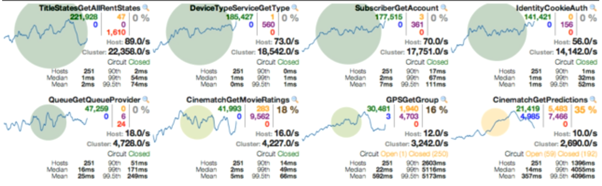

# 1、Hystrix

##  1.1、分布式系统面临的问题


## 1.2、Hystrix是什么


[官网资料](https://github.com/Netflix/Hystrix/wiki/How-To-Use)

Hystrix能做什么

- 服务降级
- 服务熔断
- 实时的监控（Dashboard）
- 。。。。。

## 1.3、服务降级

**服务器忙，请稍候再试，不让客户端等待并立刻返回一个友好提示，fallback**

  **当双11活动时，把无关交易的服务统统降级，如查看蚂蚁深林，查看历史订单，商品历史评论，只显示最后100条等等。**

哪些情况会导致服务降级

- 服务运行异常
- 超时
- 服务熔断触发服务降级
- 线程池/信号量打满也会导致服务降级
- 。。。。。

## 1.4、服务熔断

在介绍熔断机制之前，我们需要了解微服务的**雪崩效应**。在微服务架构中，微服务是完成一个单一的业务功能，这样做的好处是可以做到解耦，每个微服务可以独立演进。但是，一个应用可能会有多个微服务组成，微服务之间的数据交互通过远程过程调用完成。这就带来一个问题，假设微服务A调用微服务B和微服务C，微服务B和微服务C又调用其它的微服务，这就是所谓的“扇出”。如果扇出的链路上某个微服务的调用响应时间过长或者不可用，对微服务A的调用就会占用越来越多的系统资源，进而引起系统崩溃，所谓的“雪崩效应”。

熔断机制是应对雪崩效应的一种微服务链路保护机制。我们在各种场景下都会接触到熔断这两个字。高压电路中，如果某个地方的电压过高，熔断器就会熔断，对电路进行保护。股票交易中，如果股票指数过高，也会采用熔断机制，暂停股票的交易。同样，在微服务架构中，熔断机制也是起着类似的作用。当扇出链路的某个微服务不可用或者响应时间太长时，会进行服务的降级，进而熔断该节点微服务的调用，快速返回错误的响应信息。当检测到该节点微服务调用响应正常后，恢复调用链路。

[原文链接](https://blog.csdn.net/llianlianpay/article/details/79768890)

## 1.5、区别

**相同点：**

- 目的很一致，都是从可用性可靠性着想，为防止系统的整体缓慢甚至崩溃，采用的技术手段；
- 最终表现类似，对于两者来说，最终让用户体验到的是某些功能暂时不可达或不可用；
- 粒度一般都是服务级别，当然，业界也有不少更细粒度的做法，比如做到数据持久层（允许查询，不允许增删改）；
- 自治性要求很高，熔断模式一般都是服务基于策略的自动触发，降级虽说可人工干预，但在微服务架构下，完全靠人显然不可能，开关预置、配置中心都是必要手段；

**区别：**

- 触发原因不太一样，服务熔断一般是某个服务（下游服务）故障引起，而服务降级一般是从整体负荷考虑；
- 管理目标的层次不太一样，熔断其实是一个框架级的处理，每个微服务都需要（无层级之分），而降级一般需要对业务有层级之分（比如降级一般是从最外围服务开始）
- 实现方式不太一样；服务降级具有代码侵入性(由控制器完成/或自动降级)，熔断一般称为自我熔断。
  [原文链接](https://blog.csdn.net/llianlianpay/article/details/79768890)

## 1.6、服务限流

限流的目的是通过对并发访问/请求进行限速或者一个时间窗口内的的请求进行限速来保护系统，一旦达到限制速率则可以拒绝服务（定向到错误页或告知资源没有了）、排队或等待（比如秒杀、评论、下单）、降级（返回兜底数据或默认数据，如商品详情页库存默认有货）。

一般开发高并发系统常见的限流有：限制总并发数（比如数据库连接池、线程池）、限制瞬时并发数（如nginx的limit_conn模块，用来限制瞬时并发连接数）、限制时间窗口内的平均速率（如Guava的RateLimiter、nginx的limit_req模块，限制每秒的平均速率）；其他还有如限制远程接口调用速率、限制MQ的消费速率。另外还可以根据网络连接数、网络流量、CPU或内存负载等来限流。

[原文链接](https://blog.csdn.net/llianlianpay/article/details/79768890)

# 2、入门

## 2.1、模块一

请参考Eureka这篇博客，该片博客有完整的项目结构

**新建cloud-provider-hystrix-payment8001**

pom.xml

~~~xml
<?xml version="1.0" encoding="UTF-8"?>
<project xmlns="http://maven.apache.org/POM/4.0.0"
         xmlns:xsi="http://www.w3.org/2001/XMLSchema-instance"
         xsi:schemaLocation="http://maven.apache.org/POM/4.0.0 http://maven.apache.org/xsd/maven-4.0.0.xsd">
    <parent>
        <artifactId>springcloud</artifactId>
        <groupId>com.feige</groupId>
        <version>1.0-SNAPSHOT</version>
    </parent>
    <modelVersion>4.0.0</modelVersion>

    <artifactId>cloud-provider-hystrix-payment8001</artifactId>

    <dependencies>
        <!--新增hystrix-->
        <dependency>
            <groupId>org.springframework.cloud</groupId>
            <artifactId>spring-cloud-starter-netflix-hystrix</artifactId>
        </dependency>
        <dependency>
            <groupId>org.springframework.cloud</groupId>
            <artifactId>spring-cloud-starter-netflix-eureka-client</artifactId>
        </dependency>


        <dependency>
            <groupId>com.feige</groupId>
            <artifactId>cloud-api-commons</artifactId>
            <version>${project.version}</version>
        </dependency>


        <dependency>
            <groupId>org.springframework.boot</groupId>
            <artifactId>spring-boot-starter-web</artifactId>
        </dependency>

        <dependency>
            <groupId>org.springframework.boot</groupId>
            <artifactId>spring-boot-starter-actuator</artifactId>
        </dependency>

        <dependency>
            <groupId>org.springframework.boot</groupId>
            <artifactId>spring-boot-devtools</artifactId>
            <scope>runtime</scope>
            <optional>true</optional>
        </dependency>

        <dependency>
            <groupId>org.projectlombok</groupId>
            <artifactId>lombok</artifactId>
            <optional>true</optional>
        </dependency>
        <dependency>
            <groupId>org.springframework.boot</groupId>
            <artifactId>spring-boot-starter-test</artifactId>
            <scope>test</scope>
        </dependency>
    </dependencies>

</project>
~~~


PaymentService.java

~~~java
package com.feige.Service;

import cn.hutool.core.util.IdUtil;
import com.netflix.hystrix.contrib.javanica.annotation.HystrixCommand;
import com.netflix.hystrix.contrib.javanica.annotation.HystrixProperty;
import org.springframework.stereotype.Service;
import org.springframework.web.bind.annotation.PathVariable;

import java.util.concurrent.TimeUnit;

@Service
public class PaymentService {

    //服务限流测试
    //成功
    public String paymentInfo_OK(Integer id){
        return "线程池："+Thread.currentThread().getName()+"   paymentInfo_OK,id：  "+id+"\t"+"哈哈哈"  ;
    }

    //失败
    @HystrixCommand(fallbackMethod = "paymentInfo_TimeOutHandler",commandProperties = {
            @HystrixProperty(name = "execution.isolation.thread.timeoutInMilliseconds", value = "3000")
    })
    public String paymentInfo_TimeOut(Integer id){
        int timeNumber = 3;
        try { TimeUnit.SECONDS.sleep(timeNumber); }catch (Exception e) {e.printStackTrace();}
        return "线程池："+Thread.currentThread().getName()+"   paymentInfo_TimeOut,id：  "+id+"\t"+"呜呜呜"+" 耗时(秒)"+timeNumber;
    }
    public String paymentInfo_TimeOutHandler(Integer id){
        return "服务繁忙，请稍后再试";
    }

    //服务熔断测试
    @HystrixCommand(fallbackMethod = "paymentCircuitBreaker_fallback",commandProperties = {
            @HystrixProperty(name = "circuitBreaker.enabled",value = "true"),  //是否开启断路器
            @HystrixProperty(name = "circuitBreaker.requestVolumeThreshold",value = "10"),   //请求次数
            @HystrixProperty(name = "circuitBreaker.sleepWindowInMilliseconds",value = "10000"),  //时间范围
            @HystrixProperty(name = "circuitBreaker.errorThresholdPercentage",value = "60"), //失败率达到多少后跳闸
    })
    public String paymentCircuitBreaker(Integer id){
        if (id < 0){
            throw new RuntimeException("*****id 不能负数");
        }
        String serialNumber = IdUtil.simpleUUID();

        return Thread.currentThread().getName()+"\t"+"调用成功,流水号："+serialNumber;
    }
    public String paymentCircuitBreaker_fallback(@PathVariable("id") Integer id){
        return "id 不能负数，请稍候再试,(┬＿┬)/~~     id: " +id;
    }


}

~~~


PaymentController.java

~~~java
package com.feige.controller;

import com.feige.Service.PaymentService;
import lombok.extern.slf4j.Slf4j;
import org.springframework.beans.factory.annotation.Value;
import org.springframework.web.bind.annotation.GetMapping;
import org.springframework.web.bind.annotation.PathVariable;
import org.springframework.web.bind.annotation.RestController;

import javax.annotation.Resource;

@RestController
@Slf4j
public class PaymentController {

    @Resource
    private PaymentService paymentService;

    @Value("${server.port}")
    private String serverPort;

    @GetMapping("/payment/hystrix/ok/{id}")
    public String paymentInfo_OK(@PathVariable("id") Integer id){
        String result = paymentService.paymentInfo_OK(id);
        log.info("*******result:"+result);
        return result;
    }
    @GetMapping("/payment/hystrix/timeout/{id}")
    public String paymentInfo_TimeOut(@PathVariable("id") Integer id){
        String result = paymentService.paymentInfo_TimeOut(id);
        log.info("*******result:"+result);
        return result;
    }

    @GetMapping("/payment/hystrix/circuit/{id}")
    public String paymentCircuitBreaker(@PathVariable("id") Integer id){
        String result = paymentService.paymentCircuitBreaker(id);
        log.info("*******result:"+result);
        return result;
    }
}

~~~

application.yaml

~~~yaml
server:
  port: 8001


eureka:
  client:
    register-with-eureka: true    #是否向注册中心注册自己
    fetch-registry: true   #自己是否是注册中心，职责是维护服务实例，并不需要去检索服务
    service-url:
      # defaultZone: http://eureka7002.com:7002/eureka/    #设置与eureka server交互的地址查询服务和注册服务都需要依赖这个地址
      defaultZone: http://eureka7001.com:7001/eureka/
#  server:
#    enable-self-preservation: false
spring:
  application:
    name: cloud-provider-hystrix-payment
  #    eviction-interval-timer-in-ms: 2000


~~~

主启动类

HystrixApplication8001.java

```java
package com.feige;

import com.netflix.hystrix.contrib.metrics.eventstream.HystrixMetricsStreamServlet;
import org.springframework.boot.SpringApplication;
import org.springframework.boot.autoconfigure.SpringBootApplication;
import org.springframework.boot.web.servlet.ServletRegistrationBean;
import org.springframework.cloud.client.circuitbreaker.EnableCircuitBreaker;
import org.springframework.cloud.client.discovery.EnableDiscoveryClient;
import org.springframework.cloud.netflix.eureka.EnableEurekaClient;
import org.springframework.context.annotation.Bean;

@SpringBootApplication
@EnableEurekaClient
@EnableDiscoveryClient
@EnableCircuitBreaker
public class HystrixApplication8001 {

    public static void main(String[] args) {
        SpringApplication.run(HystrixApplication8001.class,args);
    }

    /**
     * 高版本开启dashboard需要
     * @return
     */
    @Bean
    public ServletRegistrationBean getServlet(){
        HystrixMetricsStreamServlet streamServlet = new HystrixMetricsStreamServlet();
        ServletRegistrationBean registrationBean = new ServletRegistrationBean(streamServlet);
        registrationBean.setLoadOnStartup(1);
        registrationBean.addUrlMappings("/hystrix.stream");
        registrationBean.setName("HystrixMetricsStreamServlet");
        return registrationBean;
    }


}
```


项目的结构图


## 2.2、模块二

**新建cloud-consumer-feign-hystrix-order80**

pom.xml

~~~xml
<?xml version="1.0" encoding="UTF-8"?>
<project xmlns="http://maven.apache.org/POM/4.0.0"
         xmlns:xsi="http://www.w3.org/2001/XMLSchema-instance"
         xsi:schemaLocation="http://maven.apache.org/POM/4.0.0 http://maven.apache.org/xsd/maven-4.0.0.xsd">
    <parent>
        <artifactId>springcloud</artifactId>
        <groupId>com.feige</groupId>
        <version>1.0-SNAPSHOT</version>
    </parent>
    <modelVersion>4.0.0</modelVersion>

    <artifactId>cloud-consumer-feign-hystrix-order80</artifactId>

    <dependencies>
        <!--新增hystrix-->
        <dependency>
            <groupId>org.springframework.cloud</groupId>
            <artifactId>spring-cloud-starter-netflix-hystrix</artifactId>
        </dependency>
        <dependency>
            <groupId>org.springframework.cloud</groupId>
            <artifactId>spring-cloud-starter-openfeign</artifactId>
        </dependency>
        <dependency>
            <groupId>org.springframework.cloud</groupId>
            <artifactId>spring-cloud-starter-netflix-eureka-client</artifactId>
        </dependency>
        <dependency>
            <groupId>com.feige</groupId>
            <artifactId>cloud-api-commons</artifactId>
            <version>${project.version}</version>
        </dependency>
        <dependency>
            <groupId>org.springframework.boot</groupId>
            <artifactId>spring-boot-starter-web</artifactId>
        </dependency>

        <dependency>
            <groupId>org.springframework.boot</groupId>
            <artifactId>spring-boot-starter-actuator</artifactId>
        </dependency>

        <dependency>
            <groupId>org.springframework.boot</groupId>
            <artifactId>spring-boot-devtools</artifactId>
            <scope>runtime</scope>
            <optional>true</optional>
        </dependency>

        <dependency>
            <groupId>org.projectlombok</groupId>
            <artifactId>lombok</artifactId>
            <optional>true</optional>
        </dependency>
        <dependency>
            <groupId>org.springframework.boot</groupId>
            <artifactId>spring-boot-starter-test</artifactId>
            <scope>test</scope>
        </dependency>
    </dependencies>

</project>
~~~


PaymentService.java

~~~java
package com.feige.Service;

import com.feige.Service.impl.PaymentHystrixServiceImpl;
import com.netflix.hystrix.contrib.javanica.annotation.HystrixCommand;
import org.springframework.cloud.openfeign.FeignClient;
import org.springframework.stereotype.Component;
import org.springframework.web.bind.annotation.GetMapping;
import org.springframework.web.bind.annotation.PathVariable;

@Component
@FeignClient(value = "CLOUD-PROVIDER-HYSTRIX-PAYMENT")
//业务方法和兜底方法分离需要在@FeignClient中加上兜底的类
//@FeignClient(value = "CLOUD-PROVIDER-HYSTRIX-PAYMENT", fallback = PaymentHystrixServiceImpl.class)
public interface PaymentService {
    @GetMapping("/payment/hystrix/ok/{id}")
    String paymentInfo_OK(@PathVariable("id") Integer id);

    @GetMapping("/payment/hystrix/timeout/{id}")
    String paymentInfo_TimeOut(@PathVariable("id") Integer id);
}

~~~

PaymentHystrixServiceImpl.java

~~~java
package com.feige.Service.impl;

import com.feige.Service.PaymentService;
import org.springframework.stereotype.Component;

/**
 * 业务方法和兜底方法分离
 */
@Component
public class PaymentHystrixServiceImpl implements PaymentService {
    @Override
    public String paymentInfo_OK(Integer id) {
        return "服务器繁忙，请稍后再试!!!";
    }

    @Override
    public String paymentInfo_TimeOut(Integer id) {
        return "服务器繁忙，请稍后再试!!!!";
    }
}

~~~


OrderController.java

~~~java
package com.feige.controller;

import com.feige.Service.PaymentService;
import com.netflix.hystrix.contrib.javanica.annotation.DefaultProperties;
import com.netflix.hystrix.contrib.javanica.annotation.HystrixCommand;
import lombok.extern.slf4j.Slf4j;
import org.springframework.web.bind.annotation.GetMapping;
import org.springframework.web.bind.annotation.PathVariable;
import org.springframework.web.bind.annotation.RestController;

import javax.annotation.Resource;


@RestController
@Slf4j
//为每一个服务都写一个兜底方法特别麻烦，通过这种方式可以减少代码量
@DefaultProperties(defaultFallback = "globalHandler")
public class OrderController {

    @Resource
    private PaymentService paymentService;

    @GetMapping("/consumer/payment/hystrix/ok/{id}")
    @HystrixCommand
    public String paymentInfo_OK(@PathVariable("id") Integer id){
        return paymentService.paymentInfo_OK(id);
    }
    @GetMapping("/consumer/payment/hystrix/timeout/{id}")
    @HystrixCommand
    public String paymentInfo_TimeOut(@PathVariable("id") Integer id){
        return paymentService.paymentInfo_TimeOut(id);
    }

    public String globalHandler(){
        return "服务器繁忙，请稍后再试！！！！！";
    }
}

~~~

application.yaml

~~~yaml

spring:
  application:
    name: cloud-provider-hystrix-order
server:
  port: 80

eureka:
  client:
    register-with-eureka: true    #表识不向注册中心注册自己
    fetch-registry: true   #表示自己就是注册中心，职责是维护服务实例，并不需要去检索服务
    service-url:
      defaultZone: http://eureka7001.com:7001/eureka/
feign:
  hystrix:
    enabled: true

~~~

主启动类

HystrixApplication80.java

~~~java
package com.feige;


import org.springframework.boot.SpringApplication;
import org.springframework.boot.autoconfigure.SpringBootApplication;
import org.springframework.cloud.client.discovery.EnableDiscoveryClient;
import org.springframework.cloud.netflix.eureka.EnableEurekaClient;
import org.springframework.cloud.netflix.hystrix.EnableHystrix;
import org.springframework.cloud.openfeign.EnableFeignClients;

@SpringBootApplication
@EnableDiscoveryClient
@EnableEurekaClient
@EnableFeignClients
@EnableHystrix
public class HystrixApplication80 {

    public static void main(String[] args) {
        SpringApplication.run(HystrixApplication80.class,args);
    }
}

~~~


项目结构图


## 2.3、开启Dashboard

**新建cloud-consumer-hystrix-dashboard9001**

pom.xml

~~~java
<?xml version="1.0" encoding="UTF-8"?>
<project xmlns="http://maven.apache.org/POM/4.0.0"
         xmlns:xsi="http://www.w3.org/2001/XMLSchema-instance"
         xsi:schemaLocation="http://maven.apache.org/POM/4.0.0 http://maven.apache.org/xsd/maven-4.0.0.xsd">
    <parent>
        <artifactId>springcloud</artifactId>
        <groupId>com.feige</groupId>
        <version>1.0-SNAPSHOT</version>
    </parent>
    <modelVersion>4.0.0</modelVersion>

    <artifactId>cloud-consumer-hystrix-dashboard9001</artifactId>


    <dependencies>
        <!--新增hystrix dashboard-->
        <dependency>
            <groupId>org.springframework.cloud</groupId>
            <artifactId>spring-cloud-starter-netflix-hystrix-dashboard</artifactId>
        </dependency>
        <dependency>
            <groupId>org.springframework.boot</groupId>
            <artifactId>spring-boot-starter-actuator</artifactId>
        </dependency>

        <dependency>
            <groupId>org.springframework.boot</groupId>
            <artifactId>spring-boot-devtools</artifactId>
            <scope>runtime</scope>
            <optional>true</optional>
        </dependency>

        <dependency>
            <groupId>org.projectlombok</groupId>
            <artifactId>lombok</artifactId>
            <optional>true</optional>
        </dependency>
        <dependency>
            <groupId>org.springframework.boot</groupId>
            <artifactId>spring-boot-starter-test</artifactId>
            <scope>test</scope>
        </dependency>
    </dependencies>
</project>
~~~

appliation.yaml

~~~yaml
server:
  port: 9001
~~~

主启动类

DashboardApplication9001.java

~~~~java
package com.feige;


import org.springframework.boot.SpringApplication;
import org.springframework.boot.autoconfigure.SpringBootApplication;
import org.springframework.cloud.netflix.hystrix.dashboard.EnableHystrixDashboard;

@SpringBootApplication
@EnableHystrixDashboard
public class DashboardApplication9001 {
    public static void main(String[] args) {
        SpringApplication.run(DashboardApplication9001.class,args);
    }
}

~~~~

项目结构图


### 测试

所有Provider微服务提供类（8001/8002/8003）都需要监控依赖配置

~~~xml
 
<dependency>
    <groupId>org.springframework.boot</groupId>
    <artifactId>spring-boot-starter-actuator</artifactId>
</dependency>
 

~~~

启动cloud-consumer-hystrix-dashboard9001该微服务后续将监控微服务8001

访问http://localhost:9001/hystrix

**开启Eureka和8001服务**


填写监控地址http://localhost:8001/hystrix.stream

访问下面两个测试连接

http://localhost:8001/payment/circuit/3

http://localhost:8001/payment/circuit/-3

### 监控结果，成功


### 监控结果，失败


### 如何看

- 7色
- 1圈


- 1线


说明


复杂

