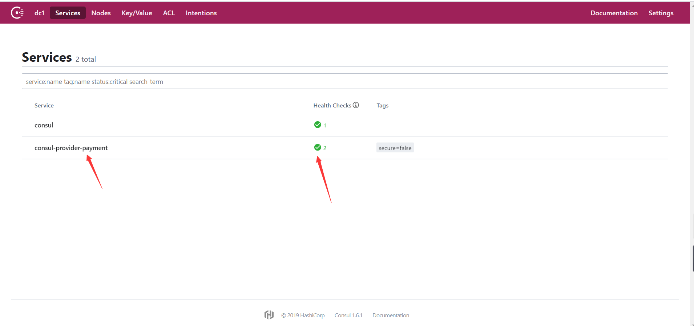
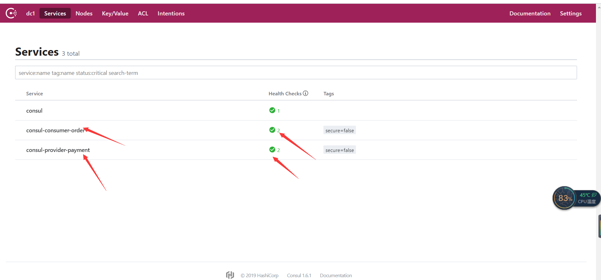

# 1、consul实现服务注册中心

**consul的概念**

Consul是一种服务网格解决方案，提供具有服务发现，配置和分段功能的全功能控制平面。 这些功能中的每一个都可以根据需要单独使用，也可以一起使用以构建全服务网格。 Consul需要数据平面并支持代理和本机集成模型。 Consul附带一个简单的内置代理，因此一切都可以开箱即用，但也支持第三方代理集成，如Envoy。
Consul 提供的关键功能：

- 服务发现：Consul的客户端可以注册服务，例如api或mysql，其他客户端可以使用Consul来发现给定服务
- 提供者。使用DNS或HTTP，应用程序可以轻松找到它们所依赖的服务。
- 运行状况检查：Consul客户端可以提供任意数量的运行状况检查，这些检查与给定服务（“是Web服务器返回200 OK”）或本地节点（“内存利用率低于90％”）相关联。运营人员可以使用此信息来监控群集运行状况，服务发现组件使用此信息将流量路由到远离不健康主机的地方。
- KV 存储：应用程序可以将Consul的层级键/值存储用于任何目的，包括动态配置，功能标记，协调，领导者选举等。简单的HTTP API使其易于使用。
- 安全服务通信：Consul可以为服务生成和分发TLS证书，以建立相互的TLS连接。Intentions(意图）可用于定义允许哪些服务进行通信。可以使用可以实时更改的意图轻松管理服务分段，而不是使用复杂的网络拓扑和静态防火墙规则。
- 多数据中心：Consul支持多个数据中心。这意味着Consul的用户不必担心构建额外的抽象层以扩展到多个区域。

新建一个父工程项目spingcloud（看Eureka这篇博客，上面有详细介绍）

## 1.1、cloud-provider-payment8006

**新建一个cloud-provider-payment8004模块**

pom.xml

~~~xml
<?xml version="1.0" encoding="UTF-8"?>
<project xmlns="http://maven.apache.org/POM/4.0.0"
         xmlns:xsi="http://www.w3.org/2001/XMLSchema-instance"
         xsi:schemaLocation="http://maven.apache.org/POM/4.0.0 http://maven.apache.org/xsd/maven-4.0.0.xsd">
    <parent>
        <artifactId>springcloud</artifactId>
        <groupId>com.feige</groupId>
        <version>1.0-SNAPSHOT</version>
    </parent>
    <modelVersion>4.0.0</modelVersion>

    <artifactId>cloud-provider-payment8006</artifactId>

    <dependencies>

        <dependency>
            <groupId>com.feige</groupId>
            <artifactId>cloud-api-commons</artifactId>
            <version>${project.version}</version>
        </dependency>

        <!-- https://mvnrepository.com/artifact/org.springframework.boot/spring-boot-starter-web -->
        <dependency>
            <groupId>org.springframework.boot</groupId>
            <artifactId>spring-boot-starter-web</artifactId>
        </dependency>

        <!-- https://mvnrepository.com/artifact/org.springframework.boot/spring-boot-starter-web -->
        <dependency>
            <groupId>org.springframework.boot</groupId>
            <artifactId>spring-boot-starter-actuator</artifactId>
        </dependency>

        <!-- https://mvnrepository.com/artifact/org.springframework.cloud/spring-cloud-starter-zookeeper-discovery -->
        <dependency>
            <groupId>org.springframework.cloud</groupId>
            <artifactId>spring-cloud-starter-consul-discovery</artifactId>
        </dependency>

        <!-- https://mvnrepository.com/artifact/org.springframework.boot/spring-boot-devtools -->
        <dependency>
            <groupId>org.springframework.boot</groupId>
            <artifactId>spring-boot-devtools</artifactId>
            <scope>runtime</scope>
            <optional>true</optional>
        </dependency>

        <!-- https://mvnrepository.com/artifact/org.projectlombok/lombok -->
        <dependency>
            <groupId>org.projectlombok</groupId>
            <artifactId>lombok</artifactId>
            <optional>true</optional>
        </dependency>

        <!-- https://mvnrepository.com/artifact/org.springframework.boot/spring-boot-starter-test -->
        <dependency>
            <groupId>org.springframework.boot</groupId>
            <artifactId>spring-boot-starter-test</artifactId>
            <scope>test</scope>
        </dependency>

    </dependencies>

</project>
~~~

application.yaml

~~~yaml
server:
  port: 8006

spring:
  application:
    name: consul-provider-payment
  cloud:
    consul:
      host: localhost
      port: 8500
      discovery:
        service-name: ${spring.application.name}

~~~

PaymentController.java

~~~java
package com.feige.controller;

import lombok.extern.slf4j.Slf4j;
import org.springframework.beans.factory.annotation.Value;
import org.springframework.web.bind.annotation.GetMapping;
import org.springframework.web.bind.annotation.RestController;

import java.util.UUID;

@RestController
@Slf4j
public class PaymentController {

    @Value("${server.port}")
    private String serverPort;

    @GetMapping(value = "/payment/consul")
    public String paymentZk(){
        return "springcloud with consul:"+serverPort+"\t"+ UUID.randomUUID().toString();
    }

}
~~~

**主启动类**

ConsulApplication8006.java

~~~java
package com.feige;

import org.springframework.boot.SpringApplication;
import org.springframework.boot.autoconfigure.SpringBootApplication;
import org.springframework.cloud.client.discovery.EnableDiscoveryClient;

@SpringBootApplication
@EnableDiscoveryClient
public class ConsulApplication8006 {
    public static void main(String[] args) {
        SpringApplication.run(ConsulApplication8006.class,args);
    }
}

~~~

## 1.2、启动consul和cloud-provider-payment8006

~~~shell
E:\consul_1.6.1_windows_amd64>consul.exe agent -dev
==> Starting Consul agent...
           Version: 'v1.6.1'
           Node ID: '1988f763-bb00-4e81-6feb-5b7dbb8ce186'
         Node name: 'LAPTOP-Q6F3A4OJ'
        Datacenter: 'dc1' (Segment: '<all>')
            Server: true (Bootstrap: false)
       Client Addr: [127.0.0.1] (HTTP: 8500, HTTPS: -1, gRPC: 8502, DNS: 8600)
      Cluster Addr: 127.0.0.1 (LAN: 8301, WAN: 8302)
           Encrypt: Gossip: false, TLS-Outgoing: false, TLS-Incoming: false, Auto-Encrypt-TLS: false

==> Log data will now stream in as it occurs:
~~~

测试`http://localhost:8006/payment/consul`

输入``http://localhost:8005`查看服务

## 1.3、cloud-consumerconsul-order80

**新建一个模块cloud-consumerconsul-order80**

pom.xml

~~~xml
<?xml version="1.0" encoding="UTF-8"?>
<project xmlns="http://maven.apache.org/POM/4.0.0"
         xmlns:xsi="http://www.w3.org/2001/XMLSchema-instance"
         xsi:schemaLocation="http://maven.apache.org/POM/4.0.0 http://maven.apache.org/xsd/maven-4.0.0.xsd">
    <parent>
        <artifactId>springcloud</artifactId>
        <groupId>com.feige</groupId>
        <version>1.0-SNAPSHOT</version>
    </parent>
    <modelVersion>4.0.0</modelVersion>

    <artifactId>cloud-consumerconsul-order80</artifactId>

    <dependencies>

        <dependency>
            <groupId>com.feige</groupId>
            <artifactId>cloud-api-commons</artifactId>
            <version>${project.version}</version>
        </dependency>

        <!-- https://mvnrepository.com/artifact/org.springframework.boot/spring-boot-starter-web -->
        <dependency>
            <groupId>org.springframework.boot</groupId>
            <artifactId>spring-boot-starter-web</artifactId>
        </dependency>

        <!-- https://mvnrepository.com/artifact/org.springframework.boot/spring-boot-starter-web -->
        <dependency>
            <groupId>org.springframework.boot</groupId>
            <artifactId>spring-boot-starter-actuator</artifactId>
        </dependency>

        <!-- https://mvnrepository.com/artifact/org.springframework.cloud/spring-cloud-starter-zookeeper-discovery -->
        <dependency>
            <groupId>org.springframework.cloud</groupId>
            <artifactId>spring-cloud-starter-consul-discovery</artifactId>
        </dependency>

        <!-- https://mvnrepository.com/artifact/org.springframework.boot/spring-boot-devtools -->
        <dependency>
            <groupId>org.springframework.boot</groupId>
            <artifactId>spring-boot-devtools</artifactId>
            <scope>runtime</scope>
            <optional>true</optional>
        </dependency>

        <!-- https://mvnrepository.com/artifact/org.projectlombok/lombok -->
        <dependency>
            <groupId>org.projectlombok</groupId>
            <artifactId>lombok</artifactId>
            <optional>true</optional>
        </dependency>

        <!-- https://mvnrepository.com/artifact/org.springframework.boot/spring-boot-starter-test -->
        <dependency>
            <groupId>org.springframework.boot</groupId>
            <artifactId>spring-boot-starter-test</artifactId>
            <scope>test</scope>
        </dependency>

    </dependencies>

</project>
~~~

application.yaml

~~~yaml
server:
  port: 80

spring:
  application:
    name: consul-consumer-order
  cloud:
    consul:
      host: localhost
      port: 8500
      discovery:
        service-name: ${spring.application.name}

~~~

OrdeConsulController.java

~~~java
package com.feige.controller;

import lombok.extern.slf4j.Slf4j;
import org.springframework.web.bind.annotation.GetMapping;
import org.springframework.web.bind.annotation.RestController;
import org.springframework.web.client.RestTemplate;

import javax.annotation.Resource;

@RestController
@Slf4j
public class OrdeConsulController {

    public static final String INVOKE_URL = "http://cloud-provider-payment";

    @Resource
    private RestTemplate restTemplate;

    @GetMapping("/consumer/payment/consul")
    public String payment (){
        String result = restTemplate.getForObject(INVOKE_URL+"/payment/consul",String.class);
        return result;
    }
}

~~~

ApplicationContextConfig.java

~~~java
package com.feige.config;

import org.springframework.cloud.client.loadbalancer.LoadBalanced;
import org.springframework.context.annotation.Bean;
import org.springframework.context.annotation.Configuration;
import org.springframework.web.client.RestTemplate;

@Configuration
public class ApplicationContextConfig {

    @LoadBalanced
    @Bean
    public RestTemplate getRestTemplate(){
        return new RestTemplate();
    }
}

~~~

**主启动类**

ConsulOrderApplication80.java

~~~java
package com.feige;

import org.springframework.boot.SpringApplication;
import org.springframework.boot.autoconfigure.SpringBootApplication;
import org.springframework.cloud.client.discovery.EnableDiscoveryClient;

@SpringBootApplication
@EnableDiscoveryClient
public class ConsulOrderApplication80 {
    public static void main(String[] args) {
        SpringApplication.run(ConsulOrderApplication80.class,args);
    }
}
~~~

## 1.4、启动cloud-consumerconsul-order80

测试`http://localhost/consumer/payment/consul`

输入``http://localhost:8500`

# 2、总结

- C:Consistency(强一致性)
- A:Availability(可用性)
- P:Partition tolerance(分区容错)

CAP理论关注粒度是数据，而不是整体系统设计的策略

在这里介绍下Eureka、Zookeeper和consul这三种服务治理框架的区别。Spring Cloud Eureka实现的服务治理机制强调了CAP原理中的AP，即可用性与可靠性，而Zookeeper和consul这类强调CP（一致性、可靠性）。Eureka为了实现更高的服务可用性，牺牲了一定的一致性，在极端情况下它宁愿接受故障实例也不要丢掉“健康”实例，比如，当服务注册中心的网络发生故障断开时，由于所有的服务实例无法维持续约心跳，在强调CP的服务治理中将会把所有服务实例都剔除掉，而Eureka则会触发保护机制，保留此时的所有节点，以实现服务间依然可以进行互相调用的场景。

