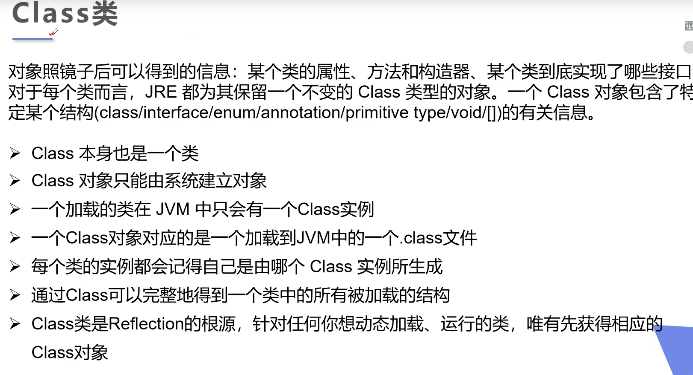

# 反射

# 1、什么是反射机制？

JAVA反射机制是在运行状态中，对于任意一个类，都能够知道这个类的所有属性和方法；对于任意一个对象，都能够调用它的任意一个方法和属性；这种动态获取的信息以及动态调用对象的方法的功能称为java语言的反射机制。

# 2、Java获取反射的三种方法

- 通过new对象实现反射机制 

- 通过全类名实现反射机制 

- 通过类名实现反射机制

~~~java
package com.feige.reflect;

import com.feige.pojo.User;

public class ReflectTest {
    public static void main(String[] args) throws ClassNotFoundException {
        //所有类都继承Object类，通过new对象调用getClass()方法可以获得一个Class对象
        User user = new User();
        Class<? extends User> c1 = user.getClass();
        System.out.println(c1);
        //通过全类名路径
        Class<?> c2 = Class.forName("com.feige.pojo.User");
        System.out.println(c2);
        //通过类名点class
        Class<User> c3 = User.class;
        System.out.println(c3);
       
        //所有内置包装类都有一个TYPE，可以获得Class对象
        Class<Integer> type = Integer.TYPE;
        System.out.println(type);
    }
}

~~~

~~~txt
class com.feige.pojo.User
class com.feige.pojo.User
class com.feige.pojo.User
int
~~~

# 3、Class类

~~~java
package com.feige.reflect;

import com.feige.pojo.User;
import org.junit.Test;

import java.lang.annotation.ElementType;

public class ReflectTest {
    @Test
    public void test(){
        Class c1 = Object.class;//类
        Class c2 = String[].class;//一维数组
        Class c3 = int[][].class;//二维数组
        Class c4 = Override.class;//注解
        Class c5 = ElementType.class;//枚举
        Class c6 = Comparable.class;//接口
        Class c7 = Integer.class;//包装类
        Class c8 = void.class;//void
        Class c9 = Class.class;//Class
        System.out.println(c1);
        System.out.println(c2);
        System.out.println(c3);
        System.out.println(c4);
        System.out.println(c5);
        System.out.println(c6);
        System.out.println(c7);
        System.out.println(c8);
        System.out.println(c9);
    }
}

~~~

~~~txt
class java.lang.Object
class [Ljava.lang.String;
class [[I
interface java.lang.Override
class java.lang.annotation.ElementType
interface java.lang.Comparable
class java.lang.Integer
void
class java.lang.Class
~~~

# 4、类加载与ClassLoader的理解

## 类加载器

类加载器负责加载所有的类，其为所有被载入内存中的类生成一个java.lang.Class实例对象。一旦一个类被加载如JVM中，同一个类就不会被再次载入了。正如一个对象有一个唯一的标识一样，一个载入JVM的类也有一个唯一的标识。在Java中，一个类用其全限定类名（包括包名和类名）作为标识；但在JVM中，一个类用其全限定类名和其类加载器作为其唯一标识。

- **根类加载器**（bootstrap class loader）:它用来加载 Java 的核心类，是用原生代码来实现的，并不继承自 java.lang.ClassLoader（负责加载$JAVA_HOME中jre/lib/rt.jar里所有的class，由C++实现，不是ClassLoader子类）。由于引导类加载器涉及到虚拟机本地实现细节，开发者无法直接获取到启动类加载器的引用，所以不允许直接通过引用进行操作。

- **扩展类加载器**（extensions class loader）：它负责加载JRE的扩展目录，lib/ext或者由java.ext.dirs系统属性指定的目录中的JAR包的类。由Java语言实现，父类加载器为null。

- **系统类加载器**（system class loader）：被称为系统（也称为应用）类加载器，它负责在JVM启动时加载来自Java命令的-classpath选项、java.class.path系统属性，或者CLASSPATH换将变量所指定的JAR包和类路径。程序可以通过ClassLoader的静态方法getSystemClassLoader()来获取系统类加载器。如果没有特别指定，则用户自定义的类加载器都以此类加载器作为父加载器。由Java语言实现，父类加载器为ExtClassLoader。

类加载器加载Class大致要经过如下8个步骤：

1. 检测此Class是否载入过，即在缓冲区中是否有此Class，如果有直接进入第8步，否则进入第2步。
2. 如果没有父类加载器，则要么Parent是根类加载器，要么本身就是根类加载器，则跳到第4步，如果父类加载器存在，则进入第3步。
3. 请求使用父类加载器去载入目标类，如果载入成功则跳至第8步，否则接着执行第5步。
4. 请求使用根类加载器去载入目标类，如果载入成功则跳至第8步，否则跳至第7步。
5. 当前类加载器尝试寻找Class文件，如果找到则执行第6步，如果找不到则执行第7步。
6. 从文件中载入Class，成功后跳至第8步。
7. 抛出ClassNotFountException异常。
8. 返回对应的java.lang.Class对象

[原文链接](https://blog.csdn.net/m0_38075425/article/details/81627349?ops_request_misc=%257B%2522request%255Fid%2522%253A%2522160215110219195240425369%2522%252C%2522scm%2522%253A%252220140713.130102334.pc%255Fblog.%2522%257D&request_id=160215110219195240425369&biz_id=0&utm_medium=distribute.pc_search_result.none-task-blog-2~blog~first_rank_v1~rank_blog_v1-1-81627349.pc_v1_rank_blog_v1&utm_term=%E7%B1%BB%E5%8A%A0%E8%BD%BD%E6%9C%BA%E5%88%B6%E2%80%98%E2%80%99&spm=1018.2118.3001.4187)

~~~java
package com.feige.classloader;

public class ClassLoaderTest {
    public static void main(String[] args) throws ClassNotFoundException {
        //获取系统类的加载器
        ClassLoader systemClassLoader = ClassLoader.getSystemClassLoader();
        System.out.println(systemClassLoader);
        //获取系统加载器的父类加载器-->扩展类加载器
        ClassLoader parent = systemClassLoader.getParent();
        System.out.println(parent);
        //获取扩展类加载器的父类加载器-->根加载器(c/c++)
        ClassLoader parent1 = parent.getParent();
        System.out.println(parent1);
        //测试当前类是由哪个加载器加载的
        Class<?> aClass = Class.forName("com.feige.classloader.ClassLoaderTest");
        ClassLoader classLoader = aClass.getClassLoader();
        System.out.println(classLoader);
        //测试JDK内置的类是谁加载的
        Class<?> aClass1 = Class.forName("java.lang.Object");
        ClassLoader classLoader1 = aClass1.getClassLoader();
        System.out.println(classLoader1);
        //获取系统加载器加载的路径
        String property = System.getProperty("java.class.path");
        String[] split = property.split(";");
        for (String s : split) {
            System.out.println(s);
        }

    }
}

~~~

~~~java
sun.misc.Launcher$AppClassLoader@18b4aac2
sun.misc.Launcher$ExtClassLoader@6d6f6e28
null
sun.misc.Launcher$AppClassLoader@18b4aac2
null
E:\javajdk8\jre\lib\charsets.jar
E:\javajdk8\jre\lib\deploy.jar
E:\javajdk8\jre\lib\ext\access-bridge-64.jar
E:\javajdk8\jre\lib\ext\cldrdata.jar
E:\javajdk8\jre\lib\ext\dnsns.jar
E:\javajdk8\jre\lib\ext\jaccess.jar
E:\javajdk8\jre\lib\ext\jfxrt.jar
E:\javajdk8\jre\lib\ext\localedata.jar
E:\javajdk8\jre\lib\ext\nashorn.jar
E:\javajdk8\jre\lib\ext\sunec.jar
E:\javajdk8\jre\lib\ext\sunjce_provider.jar
E:\javajdk8\jre\lib\ext\sunmscapi.jar
E:\javajdk8\jre\lib\ext\sunpkcs11.jar
E:\javajdk8\jre\lib\ext\zipfs.jar
E:\javajdk8\jre\lib\javaws.jar
E:\javajdk8\jre\lib\jce.jar
E:\javajdk8\jre\lib\jfr.jar
E:\javajdk8\jre\lib\jfxswt.jar
E:\javajdk8\jre\lib\jsse.jar
E:\javajdk8\jre\lib\management-agent.jar
E:\javajdk8\jre\lib\plugin.jar
E:\javajdk8\jre\lib\resources.jar
E:\javajdk8\jre\lib\rt.jar
E:\project\java-project\java-notes-code\reflect-annotation\target\classes
E:\java\apache-maven-3.6.1\maven.repo\junit\junit\4.12\junit-4.12.jar
E:\java\apache-maven-3.6.1\maven.repo\org\hamcrest\hamcrest-core\1.3\hamcrest-core-1.3.jar
E:\IntelliJ IDEA 2019.3.3\lib\idea_rt.jar
~~~

## 类加载机制

**JVM的类加载机制**主要有如下3种。

- **全盘负责：**所谓全盘负责，就是当一个类加载器负责加载某个Class时，该Class所依赖和引用其他Class也将由该类加载器负责载入，除非显示使用另外一个类加载器来载入。
- **双亲委派：**所谓的双亲委派，则是先让父类加载器试图加载该Class，只有在父类加载器无法加载该类时才尝试从自己的类路径中加载该类。通俗的讲，就是某个特定的类加载器在接到加载类的请求时，首先将加载任务委托给父加载器，依次递归，如果父加载器可以完成类加载任务，就成功返回；只有父加载器无法完成此加载任务时，才自己去加载。
- **缓存机制：**缓存机制将会保证所有加载过的Class都会被缓存，当程序中需要使用某个Class时，类加载器先从缓存区中搜寻该Class，只有当缓存区中不存在该Class对象时，系统才会读取该类对应的二进制数据，并将其转换成Class对象，存入缓冲区中。这就是为什么修改了Class后，必须重新启动JVM，程序所做的修改才会生效的原因。

**这里说明一下双亲委派机制：**

​    双亲委派机制，其工作原理的是，如果一个类加载器收到了类加载请求，它并不会自己先去加载，而是把这个请求委托给父类的加载器去执行，如果父类加载器还存在其父类加载器，则进一步向上委托，依次递归，请求最终将到达顶层的启动类加载器，如果父类加载器可以完成类加载任务，就成功返回，倘若父类加载器无法完成此加载任务，子加载器才会尝试自己去加载，这就是双亲委派模式，即每个儿子都很懒，每次有活就丢给父亲去干，直到父亲说这件事我也干不了时，儿子自己才想办法去完成。

   双亲委派机制的优势：采用双亲委派模式的是好处是Java类随着它的类加载器一起具备了一种带有优先级的层次关系，通过这种层级关可以避免类的重复加载，当父亲已经加载了该类时，就没有必要子ClassLoader再加载一次。其次是考虑到安全因素，java核心api中定义类型不会被随意替换，假设通过网络传递一个名为java.lang.Integer的类，通过双亲委托模式传递到启动类加载器，而启动类加载器在核心Java API发现这个名字的类，发现该类已被加载，并不会重新加载网络传递的过来的java.lang.Integer，而直接返回已加载过的Integer.class，这样便可以防止核心API库被随意篡改。

[原文链接](https://blog.csdn.net/m0_38075425/article/details/81627349?ops_request_misc=%257B%2522request%255Fid%2522%253A%2522160215110219195240425369%2522%252C%2522scm%2522%253A%252220140713.130102334.pc%255Fblog.%2522%257D&request_id=160215110219195240425369&biz_id=0&utm_medium=distribute.pc_search_result.none-task-blog-2~blog~first_rank_v1~rank_blog_v1-1-81627349.pc_v1_rank_blog_v1&utm_term=%E7%B1%BB%E5%8A%A0%E8%BD%BD%E6%9C%BA%E5%88%B6%E2%80%98%E2%80%99&spm=1018.2118.3001.4187)

# 5、反射常用的方法

~~~java
package com.feige.pojo;

public class User {
    private String name;
    private int age;

    public User() {
    }

    public User(String name, int age) {
        this.name = name;
        this.age = age;
    }
    private User(String name){
        this.name = name;
    }
    public String getName() {
        return name;
    }

    public void setName(String name) {
        this.name = name;
    }

    public int getAge() {
        return age;
    }

    public void setAge(int age) {
        this.age = age;
    }
    private void test(){

    }
    @Override
    public String toString() {
        return "User{" +
                "name='" + name + '\'' +
                ", age=" + age +
                '}';
    }
}

~~~

~~~java
package com.feige.reflect;

import com.feige.pojo.User;
import org.junit.Test;

import java.lang.annotation.ElementType;
import java.lang.reflect.Constructor;
import java.lang.reflect.Field;
import java.lang.reflect.Method;

public class ReflectTest {
    @Test
    public void test1() throws ClassNotFoundException, NoSuchFieldException, NoSuchMethodException {
        Class<?> aClass = Class.forName("com.feige.pojo.User");
        //获得类的名字
        System.out.println(aClass.getName());//全类名
        System.out.println(aClass.getSimpleName());//简单类名，不含包名

        //获得类的属性
        //aClass.getFields()//只能获取public修饰的属性
        //获取全部属性
        Field[] fields = aClass.getDeclaredFields();
        for (Field field : fields) {
            System.out.println(field);
        }

        //获取指定属性的值(只能获取public修饰的属性)
        //Field name = aClass.getField("name");
        //System.out.println(name);
        //获取指定属性的值
        Field name1 = aClass.getDeclaredField("name");
        System.out.println(name1);

        //获取类的方法
        Method[] methods = aClass.getMethods();//获得本类及其父类的全部public方法
        for (Method method : methods) {
            System.out.println("正常：" + method);
        }

        Method[] declaredMethods = aClass.getDeclaredMethods();//获得本类的所有方法
        for (Method declaredMethod : declaredMethods) {
            System.out.println(declaredMethod);
        }

        //获得指定的方法
        Method getName = aClass.getMethod("getName", null);
        Method setName = aClass.getMethod("setName", String.class);
        System.out.println(getName);
        System.out.println(setName);
        //获得所有public修饰的构造器
        Constructor<?>[] constructors = aClass.getConstructors();
        for (Constructor<?> constructor : constructors) {
            System.out.println("正常：" + constructor);
        }
        //获得所有构造器
        Constructor<?>[] declaredConstructors = aClass.getDeclaredConstructors();
        for (Constructor<?> declaredConstructor : declaredConstructors) {
            System.out.println(declaredConstructor);
        }

        //获得指定的构造器
        Constructor<?> declaredConstructor1 = aClass.getDeclaredConstructor(String.class, int.class);
        System.out.println("指定的构造器:" + declaredConstructor1);

    }
}

~~~

~~~txt
com.feige.pojo.User
User
private java.lang.String com.feige.pojo.User.name
private int com.feige.pojo.User.age
private java.lang.String com.feige.pojo.User.name
正常：public java.lang.String com.feige.pojo.User.toString()
正常：public java.lang.String com.feige.pojo.User.getName()
正常：public void com.feige.pojo.User.setName(java.lang.String)
正常：public int com.feige.pojo.User.getAge()
正常：public void com.feige.pojo.User.setAge(int)
正常：public final void java.lang.Object.wait() throws java.lang.InterruptedException
正常：public final void java.lang.Object.wait(long,int) throws java.lang.InterruptedException
正常：public final native void java.lang.Object.wait(long) throws java.lang.InterruptedException
正常：public boolean java.lang.Object.equals(java.lang.Object)
正常：public native int java.lang.Object.hashCode()
正常：public final native java.lang.Class java.lang.Object.getClass()
正常：public final native void java.lang.Object.notify()
正常：public final native void java.lang.Object.notifyAll()
public java.lang.String com.feige.pojo.User.toString()
public java.lang.String com.feige.pojo.User.getName()
public void com.feige.pojo.User.setName(java.lang.String)
private void com.feige.pojo.User.test()
public int com.feige.pojo.User.getAge()
public void com.feige.pojo.User.setAge(int)
public java.lang.String com.feige.pojo.User.getName()
public void com.feige.pojo.User.setName(java.lang.String)
正常：public com.feige.pojo.User(java.lang.String,int)
正常：public com.feige.pojo.User()
private com.feige.pojo.User(java.lang.String)
public com.feige.pojo.User(java.lang.String,int)
public com.feige.pojo.User()
指定的构造器:public com.feige.pojo.User(java.lang.String,int)
~~~

## 通过反射创建对象

~~~java
package com.feige.reflect;

import com.feige.pojo.User;
import org.junit.Test;

import java.lang.annotation.ElementType;
import java.lang.reflect.Constructor;
import java.lang.reflect.Field;
import java.lang.reflect.InvocationTargetException;
import java.lang.reflect.Method;

public class ReflectTest {

    @Test
    public void test2() throws ClassNotFoundException, IllegalAccessException, InstantiationException, NoSuchMethodException, InvocationTargetException, NoSuchFieldException {
        Class<?> aClass =  Class.forName("com.feige.pojo.User");
        //调用无参构造
        User user = (User) aClass.newInstance();
        System.out.println(user);
        //有参构造
        Constructor<?> declaredConstructor = aClass.getDeclaredConstructor(String.class, int.class);
        User feige = (User) declaredConstructor.newInstance("feige", 20);
        System.out.println(feige);

        //获取方法
        Method setName = aClass.getDeclaredMethod("setName", String.class);
        //invoke：激活的意思，调用指定的方法
        //（对象，“方法的值”）
        setName.invoke(user,"feige");
        System.out.println(user.getName());
        System.out.println(user);

        System.out.println("---------------");
        Field name = aClass.getDeclaredField("age");
        name.setAccessible(true);//关闭权限检测
        name.set(user,20);
        System.out.println(user.getAge());
        System.out.println(user);
        
    }
}

~~~

~~~txt
User{name='null', age=0}
User{name='feige', age=20}
feige
User{name='feige', age=0}
---------------
20
User{name='feige', age=20}
~~~

## 反射、反射关闭检测和普通方法执行10亿次性能分析

~~~java
package com.feige.reflect;

import com.feige.pojo.User;
import org.junit.Test;

import java.lang.annotation.ElementType;
import java.lang.reflect.Constructor;
import java.lang.reflect.Field;
import java.lang.reflect.InvocationTargetException;
import java.lang.reflect.Method;

public class ReflectTest {

    @Test
    public void test3(){
        User user = new User();
        long startTime = System.currentTimeMillis();
        for (int i = 0; i < 1000000000; i++) {
            user.getName();
        }
        long endTime = System.currentTimeMillis();
        System.out.println("普通方法执行10亿次：" + (endTime - startTime) + "ms");
    }

    @Test
    public void test4() throws NoSuchMethodException, InvocationTargetException, IllegalAccessException {
        User user = new User();
        Class<? extends User> aClass = user.getClass();
        Method getName = aClass.getDeclaredMethod("getName");
        long startTime = System.currentTimeMillis();
        for (int i = 0; i < 1000000000; i++) {
            getName.invoke(user,null);
        }
        long endTime = System.currentTimeMillis();
        System.out.println("反射执行10亿次：" + (endTime - startTime) + "ms");
    }

    @Test
    public void test5() throws NoSuchMethodException, InvocationTargetException, IllegalAccessException {
        User user = new User();
        Class<? extends User> aClass = user.getClass();
        Method getName = aClass.getDeclaredMethod("getName");
        getName.setAccessible(true);
        long startTime = System.currentTimeMillis();
        for (int i = 0; i < 1000000000; i++) {
            getName.invoke(user,null);
        }
        long endTime = System.currentTimeMillis();
        System.out.println("反射关闭检测执行10亿次：" + (endTime - startTime) + "ms");
    }

    @Test
    public void test6(){
        try {
            test3();
            test4();
            test5();
        } catch (NoSuchMethodException e) {
            e.printStackTrace();
        } catch (InvocationTargetException e) {
            e.printStackTrace();
        } catch (IllegalAccessException e) {
            e.printStackTrace();
        }
    }
}

~~~

~~~java
普通方法执行10亿次：10ms
反射执行10亿次：2326ms
反射关闭检测执行10亿次：2132ms
~~~

## 获取泛型

~~~java
package com.feige.reflect;

import com.feige.pojo.User;
import org.junit.Test;

import java.lang.annotation.ElementType;
import java.lang.reflect.*;
import java.util.Map;

public class ReflectTest {

    @Test
    public void test7() throws NoSuchMethodException {
        Method test2 = User.class.getDeclaredMethod("test2", Map.class);
        Type[] genericParameterTypes = test2.getGenericParameterTypes();
        //获取泛型参数
        for (Type genericParameterType : genericParameterTypes) {
            System.out.println(genericParameterType);
            if (genericParameterType instanceof ParameterizedType){
                //获取泛型
                Type[] actualTypeArguments = ((ParameterizedType) genericParameterType).getActualTypeArguments();
                for (Type actualTypeArgument : actualTypeArguments) {
                    System.out.println(actualTypeArgument);
                }
            }
        }
        Method test3 = User.class.getDeclaredMethod("test3", Map.class);
        Type genericReturnType = test3.getGenericReturnType();
        System.out.println(genericReturnType);
        if (genericReturnType instanceof ParameterizedType){
            Type[] actualTypeArguments = ((ParameterizedType) genericReturnType).getActualTypeArguments();
            for (Type actualTypeArgument : actualTypeArguments) {
                System.out.println(actualTypeArgument);
            }
        }

    }
}

~~~

~~~txt
java.util.Map<java.lang.String, com.feige.pojo.User>
class java.lang.String
class com.feige.pojo.User
java.util.List<com.feige.pojo.User>
class com.feige.pojo.User
~~~

## 获取注解

#### 实战由java实体类生成MySQL建表语句

~~~java
package com.feige.generatesql.annotation;

import java.lang.annotation.*;

@Target(ElementType.TYPE)
@Retention(RetentionPolicy.RUNTIME)
@Inherited
@Documented
public @interface Table {
    //表解释
    String comment() default "";
    String charset() default "utf8";
}

~~~

~~~java
package com.feige.generatesql.annotation;

import java.lang.annotation.*;

@Target(ElementType.FIELD)
@Retention(RetentionPolicy.RUNTIME)
@Inherited
@Documented
public @interface TableField {
    //是否是主键
    boolean id() default false;
    //是否是表的属性
    boolean exist() default true;
    //属性的解释
    String comment() default "";
    //长度
    int length() default 10;
}

~~~

~~~java
package com.feige.generatesql;

import com.feige.generatesql.annotation.Table;
import com.feige.generatesql.annotation.TableField;

import java.util.Date;
import java.util.List;

@Table(comment = "菜单表")
public class Menu {

    @TableField(id = true,comment = "ID",length = 50)
    private String id;

    @TableField(comment = "父ID,所属上级",length = 50)
    private String pid;

    @TableField(comment = "名称",length = 50)
    private String name;

    @TableField(comment = "类型(1:菜单,2:按钮)")
    private Integer type;

    @TableField(comment = "权限值",length = 50)
    private String permissionValue;

    @TableField(comment = "访问路径",length = 50)
    private String path;

    @TableField(comment = "组件路径",length = 50)
    private String component;

    @TableField(comment = "图标",length = 50)
    private String icon;

    @TableField(comment = "是否是外链")
    private Integer isOutChain;

    @TableField(comment = "显示状态(false表示不隐藏，true表示隐藏）",length = 2)
    private Boolean hidden;

    @TableField(comment = "状态（0表示禁用，1表示可用）")
    private Integer status;

    @TableField(comment = "下级",exist = false)
    private List<Menu> children;

    @TableField(comment = "逻辑删除（1表示删除，0表示未删除）")
    private Integer isDelete;

    @TableField(comment = "创建时间")
    private Date gmtCreate;

    @TableField(comment = "修改时间")
    private Date gmtModified;
}

~~~

~~~java
package com.feige.generatesql;

import com.feige.generatesql.annotation.Table;
import com.feige.generatesql.annotation.TableField;

import java.io.*;
import java.lang.reflect.Field;
import java.util.ArrayList;
import java.util.Date;
import java.util.List;

public class GenerateSql {

    public static final String space = " ";
    //Java和MySQL类型转换
    public static String getType(Class<?> javaType,int length) {
        String sqlType;
        if (javaType.equals(String.class)) {
            sqlType = "varchar(" + length + ")";
        } else if (javaType.equals(Integer.class) || javaType.equals(int.class)) {
            length = Math.min(length, 11);
            sqlType = "int(" + length + ")";
        } else if (javaType.equals(Date.class)){
            sqlType = "datetime";
        } else if (javaType.equals(Float.class) || javaType.equals(float.class)){
            sqlType = "float(" + length + ")";
        } else if (javaType.equals(Double.class) || javaType.equals(double.class)){
            sqlType = "decimal(" + length + ")";
        } else if (javaType.equals(Boolean.class) || javaType.equals(boolean.class)){
            sqlType = "tinyint(2)";
        } else if (javaType.equals(Character.class) || javaType.equals(char.class)){
            sqlType = "char(" + length + ")";
        } else if (javaType.equals(Long.class) || javaType.equals(long.class)){
            sqlType = "bigint(" + length + ")";
        } else {
            sqlType = "varchar(" + length + ")";
        }
        return sqlType;
    }

    //把驼峰命名改为下划线命名
    public static String humpToUnderline(String className){
        StringBuilder tableName = new StringBuilder();
        byte[] bytes = className.getBytes();
        for (int i = 0; i < bytes.length; i++) {
            if (bytes[i] <= 90){
                String underline = i == 0 ? "": "_";
                tableName.append(underline).append((char) (bytes[i] + 32));
            }else {
                tableName.append((char)bytes[i]);
            }
        }
        return tableName.toString();
    }

    public static String generateSql(Class<?> clazz) {
        StringBuilder sql = new StringBuilder();
        sql.append("CREATE TABLE")
                .append(space);
        String tableName = humpToUnderline(clazz.getSimpleName());
        sql.append(tableName)
                .append("(")
                .append("\n");
        Field[] declaredFields = clazz.getDeclaredFields();
        for (Field declaredField : declaredFields) {
            declaredField.setAccessible(true);
            TableField annotation = declaredField.getAnnotation(TableField.class);
            if (annotation != null && annotation.exist()) {
                sql.append("\t").append(humpToUnderline(declaredField.getName())).append(space);
                Class<?> type = declaredField.getType();
                String sqlType = getType(type,annotation.length());
                sql.append(sqlType);
                if (annotation.id()){
                    sql.append(space).append("primary key");
                }
                sql.append(space)
                        .append("comment")
                        .append(space)
                        .append("'")
                        .append(annotation.comment())
                        .append("'")
                        .append(",\n");
            }

        }
        int l = sql.lastIndexOf(",");
        sql.deleteCharAt(l);
        String comment = clazz.getAnnotation(Table.class).comment();
        String charset = clazz.getAnnotation(Table.class).charset();
        sql.append(") ENGINE=InnoDB DEFAULT")
                .append(space)
                .append("CHARSET=")
                .append(charset)
                .append(space)
                .append("COMMENT='")
                .append(comment)
                .append("';");
        return sql.toString();
    }
    public static List<String> generateSql(Class<?>[] classes){
        List<String> sqls = new ArrayList<String>();
        for (Class<?> aClass : classes) {
            String sql = generateSql(aClass);
            sqls.add(sql);
        }
        return sqls;
    }
    public static void main(String[] args) throws IOException {
        Writer writer = null;
        try {
            writer = new FileWriter("menu.sql");
            String sql = generateSql(Menu.class);
            writer.write(sql);
        } catch (IOException e) {
            e.printStackTrace();
        } finally {
            assert writer != null;
            writer.close();
        }
    }
}

~~~

### 生产的sql语句

~~~sql
CREATE TABLE menu(
	id varchar(50) primary key comment 'ID',
	pid varchar(50) comment '父ID,所属上级',
	name varchar(50) comment '名称',
	type int(10) comment '类型(1:菜单,2:按钮)',
	permission_value varchar(50) comment '权限值',
	path varchar(50) comment '访问路径',
	component varchar(50) comment '组件路径',
	icon varchar(50) comment '图标',
	is_out_chain int(10) comment '是否是外链',
	hidden tinyint(2) comment '显示状态(false表示不隐藏，true表示隐藏）',
	status int(10) comment '状态（0表示禁用，1表示可用）',
	is_delete int(10) comment '逻辑删除（1表示删除，0表示未删除）',
	gmt_create datetime comment '创建时间',
	gmt_modified datetime comment '修改时间'
) ENGINE=InnoDB DEFAULT CHARSET=utf8 COMMENT='菜单表';
~~~

