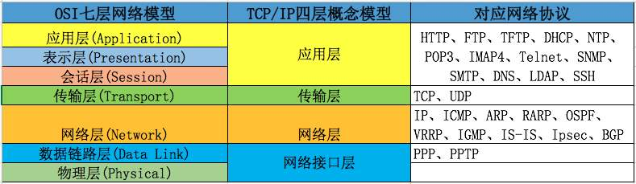

# 计算机网络

参考：[遇见狂神说](https://space.bilibili.com/95256449?spm_id_from=333.788.b_765f7570696e666f.1)

# 1、概述

**百度百科：**

计算机网络是指将[地理](https://baike.baidu.com/item/地理)位置不同的具有独立功能的多台[计算机](https://baike.baidu.com/item/计算机/140338)及其外部设备，通过通信线路连接起来，在[网络操作系统](https://baike.baidu.com/item/网络操作系统/3997)，[网络管理软件](https://baike.baidu.com/item/网络管理软件/6579078)及[网络通信协议](https://baike.baidu.com/item/网络通信协议/4438611)的管理和协调下，实现[资源共享](https://baike.baidu.com/item/资源共享/233480)和信息传递的计算机系统

网络编程： TCP/IP   C/S

网页编程： javaweb  B/S

**网络通信的要素：**

通信双方地址：

- ip
- 端口

规则：网络通信协议

**TCP/IP参考模型**

## **IP**

ip地址：InetAddress

- 唯一定位一台网络计算机
- 127.0.0.1：本机localhost
- ip地址的分类
	- ipv4/ipv6
		- IPV4 `127.0.0.1` ,4个字节。0~255， 42亿；30亿都在北美，亚州4亿。2011年就用尽；
		- IPV6 `fe80::cc81:4988:3f3a:279c%11`：128位。8位无符号整数！
	- 公网（互联网）-私网（局域网）
		- ABCD类
		- 192.168.xx.xx专门给组织内部使用的

~~~java
 //查询IP地址
InetAddress byName = InetAddress.getByName("www.baidu.com");
System.out.println(byName);
InetAddress localHost = InetAddress.getLocalHost();
System.out.println(localHost);
System.out.println(Arrays.toString(byName.getAddress()));
System.out.println(byName.getHostAddress());
~~~

## **端口**

- 不同的进程有不同端口号！用来区分软件

- 0~65535

- TCP,UDP:65535*2  TCP:80,单个协议下，端口号不能冲突

- 端口分类

  - 公有端口0~1023

  	- HTTP:80
  	- HTTPS: 443
  	- FTP:21
  	- ssh:22
  	- Telent:23
  - 程序注册端口：1024-49151，分配用户或程序
  - Tomcat：8000
  - MySQL：3306
  - oracle：1521
  - 动态、私有的49152~65535

  ~~~bash
  netstat -ano #查看所有端口
  netstat -ano | findstr "5900"# 查看指定的端口
  tasklist | findstr "8696" # 查看指定的进程
  ctrl + shift + esc # 打开任务管理器
  ~~~

  ~~~java
  InetSocketAddress inetSocketAddress = new InetSocketAddress("127.0.0.1",8000);
  System.out.println(inetSocketAddress.getAddress());
  System.out.println(inetSocketAddress.getHostName());
  System.out.println(inetSocketAddress.getPort());
  ~~~

## 通信协议

**协议：约定**

**TCP/IP协议簇：是一组协议**

百度百科

TCP/IP传输协议，即传输控制/网络协议，也叫作网络通讯协议。它是在网络的使用中的最基本的通信协议。TCP/IP传输协议对互联网中各部分进行通信的标准和方法进行了规定。并且，TCP/IP传输协议是保证网络数据信息及时、完整传输的两个重要的协议。TCP/IP传输协议是严格来说是一个四层的体系结构，应用层、传输层、网络层和数据链路层都包含其中。 [2] 

TCP/IP协议是Internet最基本的协议,其中应用层的主要协议有[Telnet](https://baike.baidu.com/item/Telnet/810597)、[FTP](https://baike.baidu.com/item/FTP/13839)、[SMTP](https://baike.baidu.com/item/SMTP/175887)等，是用来接收来自传输层的数据或者按不同应用要求与方式将数据传输至传输层；传输层的主要协议有[UDP](https://baike.baidu.com/item/UDP/571511)、TCP，是使用者使用平台和计算机信息网内部数据结合的通道，可以实现数据传输与数据共享；网络层的主要协议有ICMP、IP、IGMP，主要负责网络中数据包的传送等；而网络访问层，也叫网路接口层或数据链路层，主要协议有ARP、[RARP](https://baike.baidu.com/item/RARP/610685)，主要功能是提供链路管理错误检测、对不同通信媒介有关信息细节问题进行有效处理等。

- TCP：用户传输协议
- UDP：用户数据报协议

出名的协议：

- TCP
- IP：网络互连协议

**TCP UDP对比**

TCP: 打电话

- 连接，稳定

- **三次握手和四次挥手**

	

	

> 三次握手的本质是确认通信双方收发数据的能力
>
> 第一次握手：客户端向服务端发起连接请求，如果服务端收到则说明：服务端知道了客户端发送数据和我接受数据没问题
>
> 第二次握手： 服务端给客户端回复一段报文 ，如果客户端收到则说明：客户端知道了服务端接、发数据和我接、发数据没问题，现在还差服务端不知道自己发送数据和客户端的接受数据能力有没有问题
>
> 第三次握手：客户端给服务端回复一段报文，如果服务端收到则说明：服务端知道了自己发送数据和对方接受数据没问题
>
> **准确解释**
>
> `第一次握手`：客户端要向服务端发起连接请求，首先客户端随机生成一个起始序列号ISN(比如是100)，那客户端向服务端发送的报文段包含SYN标志位(也就是SYN=1)，序列号seq=100。
>
> `第二次握手`：服务端收到客户端发过来的报文后，发现SYN=1，知道这是一个连接请求，于是将客户端的起始序列号100存起来，并且随机生成一个服务端的起始序列号(比如是300)。然后给客户端回复一段报文，回复报文包含SYN和ACK标志(也就是SYN=1,ACK=1)、序列号seq=300、确认号ack=101(客户端发过来的序列号+1)
>
> `第三次握手`：客户端收到服务端的回复后发现ACK=1并且ack=101,于是知道服务端已经收到了序列号为100的那段报文；同时发现SYN=1，知道了服务端同意了这次连接，于是就将服务端的序列号300给存下来。然后客户端再回复一段报文给服务端，报文包含ACK标志位(ACK=1)、ack=301(服务端序列号+1)、seq=101(第一次握手时发送报文是占据一个序列号的，所以这次seq就从101开始，需要注意的是不携带数据的ACK报文是不占据序列号的，所以后面第一次正式发送数据时seq还是101)。当服务端收到报文后发现ACK=1并且ack=301，就知道客户端收到序列号为300的报文了，就这样客户端和服务端通过TCP建立了连接。

​		

> 第一次挥手：客户端向服务端发出连接释放报文
>
> 第二次挥手：服务端接受到客端发来的数据，知道了客户端要释放连接，服务端给客户端回复说我知道了，给我一点时间整理东西
>
> 第三次挥手：服务端将最后数据发送完毕后，给客户端发送连接释放报文，说我已经准备好了
>
> 第四次挥手：客户端收到了服务端发送来的FIN报文，知道了服务端已经准备好了释放链接，客户端给服务端发送确认报文，服务端释放连接
>
> **准确解释**
>
> `第一次挥手`：当客户端的数据都传输完成后，客户端向服务端发出连接释放报文(当然数据没发完时也可以发送连接释放报文并停止发送数据)，释放连接报文包含FIN标志位(FIN=1)、序列号seq=1101(100+1+1000，其中的1是建立连接时占的一个序列号)。需要注意的是客户端发出FIN报文段后只是不能发数据了，但是还可以正常收数据；另外FIN报文段即使不携带数据也要占据一个序列号。
>
> `第二次挥手`：服务端收到客户端发的FIN报文后给客户端回复确认报文，确认报文包含ACK标志位(ACK=1)、确认号ack=1102(客户端FIN报文序列号1101+1)、序列号seq=2300(300+2000)。此时服务端处于关闭等待状态，而不是立马给客户端发FIN报文，这个状态还要持续一段时间，因为服务端可能还有数据没发完。
>
> `第三次挥手`：服务端将最后数据(比如50个字节)发送完毕后就向客户端发出连接释放报文，报文包含FIN和ACK标志位(FIN=1,ACK=1)、确认号和第二次挥手一样ack=1102、序列号seq=2350(2300+50)。
>
> `第四次挥手`：客户端收到服务端发的FIN报文后，向服务端发出确认报文，确认报文包含ACK标志位(ACK=1)、确认号ack=2351、序列号seq=1102。注意客户端发出确认报文后不是立马释放TCP连接，而是要经过2MSL(最长报文段寿命的2倍时长)后才释放TCP连接。而服务端一旦收到客户端发出的确认报文就会立马释放TCP连接，所以服务端结束TCP连接的时间要比客户端早一些。

[原文链接](https://blog.csdn.net/ThinkWon/article/details/104903925?utm_source=app)

- 客户端、服务端

UDP:发短信

- 不连接，不稳定

- 客户端、服务端：没有明确的界限

- 不管有没有准备好，都可以发给你

	

# 2、编程

## TCP

**服务端：**

~~~java
package com.feige.net;

import com.sun.org.apache.xpath.internal.operations.String;
import org.junit.Test;

import java.io.ByteArrayOutputStream;
import java.io.IOException;
import java.io.InputStream;
import java.net.ServerSocket;
import java.net.Socket;

public class TcpServerDemo {

    @Test
    public void test1() throws IOException {
        ServerSocket socket = null;
        InputStream is = null;
        ByteArrayOutputStream baos = null;
        try {
            //建立服务器端口，IP不写默认为本机的IP
            socket = new ServerSocket(9999);
            Socket accept;
            while (true){
                //等待用户连接
                accept = socket.accept();
                //接受用户的消息
                is = accept.getInputStream();
                byte[] bytes = new byte[1024];
                baos = new ByteArrayOutputStream();
                int len;
                while ((len = is.read(bytes)) != -1){
                    baos.write(bytes,0,len);
                }
                System.out.println(baos.toString());
            }
        }catch (Exception e){
            e.printStackTrace();
        }finally {
            assert baos != null;
            baos.close();
            is.close();
            socket.close();
        }

    }
}

~~~

**客户端：**

~~~java
package com.feige.net;

import org.junit.Test;

import java.io.IOException;
import java.io.OutputStream;
import java.net.InetAddress;
import java.net.Socket;

public class TcpClientDemo {
    @Test
    public void test1() throws IOException {
        Socket socket = null;
        OutputStream os = null;
        try {
            //获取本机的IP
            InetAddress byName = InetAddress.getByName("127.0.0.1");
            //链接服务器
            socket = new Socket(byName,9999);
            //发送消息
            os = socket.getOutputStream();
            os.write("大家好，我是飞哥".getBytes());

        }catch (Exception e){
            e.printStackTrace();
        }finally {
            assert socket != null;
            socket.close();
            assert os != null;
            os.close();
        }

    }
}

~~~

## 文件上传

**服务端：**

~~~java
package com.feige.net;

import org.junit.Test;

import java.io.*;
import java.net.ServerSocket;
import java.net.Socket;

public class TcpServerDemo2 {
    @Test
    public void test1() throws IOException {
        File file = new File("C:\\Users\\Administrator\\Pictures\\Saved Pictures\\sw.png");
        ServerSocket socket = null;
        InputStream is = null;
        OutputStream fos = null;
        OutputStream os = null;
        try {
            //建立服务器端口，IP不写默认为本机的IP
            socket = new ServerSocket(9999);
            Socket accept;
            //等待用户连接
            accept = socket.accept();
            //接受用户的消息
            is = accept.getInputStream();
            byte[] bytes = new byte[1024];
            fos = new FileOutputStream(file);
            int len;
            while ((len = is.read(bytes)) != -1) {
                fos.write(bytes, 0, len);
            }
            //通知客户端接收完毕
            os = accept.getOutputStream();
            os.write("我接收完毕，你可以断开了".getBytes());
        } catch (Exception e) {
            e.printStackTrace();
        } finally {
            assert os != null;
            os.close();
            fos.close();
            is.close();
            socket.close();
        }
    }
}

~~~

**客户端：**

~~~java
package com.feige.net;

import org.junit.Test;

import java.io.*;
import java.net.InetAddress;
import java.net.Socket;

public class TcpClientDemo2 {

    @Test
    public void test1() throws IOException {
        File file = new File("C:\\Users\\Administrator\\Pictures\\Saved Pictures\\sw4.jpg");
        Socket socket = null;
        OutputStream os = null;
        InputStream fis = null;
        InputStream is = null;
        ByteArrayOutputStream baos = null;
        try {
            InetAddress byName = InetAddress.getByName("127.0.0.1");
            socket = new Socket(byName,9999);
            os = socket.getOutputStream();
            fis = new FileInputStream(file);
            byte[] bytes = new byte[1024];
            int len;
            while ((len = fis.read(bytes)) != -1){
                os.write(bytes,0,len);
            }
            //通知服务器我已经结束了
            socket.shutdownOutput();
            //确认服务器接收完毕后，关闭连接
            is = socket.getInputStream();
            byte[] bytes1 = new byte[1024];
            baos = new ByteArrayOutputStream();
            int len1;
            while ((len1 = is.read(bytes1)) != -1){
                baos.write(bytes1,0,len1);
            }
            System.out.println(baos.toString());
        }catch (Exception e){
            e.printStackTrace();
        }finally {
            assert baos != null;
            baos.close();
            is.close();
            fis.close();
            os.close();
            socket.close();
        }
    }
}

~~~

## TCP实现在线聊天

**服务端/读写线程**

~~~java

package com.feige.chat;

import java.io.IOException;
import java.io.InputStream;
import java.net.Socket;

public class TcpServerRead implements Runnable {

    private Socket socket;
    InputStream is;

    public TcpServerRead(Socket socket) {
        this.socket = socket;
    }

    public void run() {
        try {
            this.is = this.socket.getInputStream();
            while (true) {
                byte[] bytes = new byte[1024];
                int len = is.read(bytes);
                String string = new String(bytes, 0, len);
                System.out.println("客户端：" + string);
            }
        } catch (IOException e) {
            e.printStackTrace();
        }finally {
            try {
                this.is.close();
                this.socket.close();
            } catch (IOException e) {
                e.printStackTrace();
            }
        }
    }
}

~~~

~~~java

package com.feige.chat;

import java.io.BufferedReader;
import java.io.IOException;
import java.io.InputStreamReader;
import java.io.OutputStream;
import java.net.Socket;

public class TcpServerWrite implements Runnable {
    private Socket socket;
    BufferedReader reader;
    OutputStream os;

    public TcpServerWrite(Socket socket) {
        this.socket = socket;
        this.reader = new BufferedReader(new InputStreamReader(System.in));
    }

    public void run() {
        try {
            this.os = this.socket.getOutputStream();
            while (true) {
                String msg = this.reader.readLine();
                this.os.write(msg.getBytes(),0,msg.getBytes().length);
            }
        } catch (Exception e) {
            e.printStackTrace();
        } finally {
            try {
                this.reader.close();
                this.os.close();
                this.socket.close();
            } catch (IOException e) {
                e.printStackTrace();
            }
        }
    }
}

~~~

**客户端/读写线程：**

~~~java
package com.feige.chat;

import java.io.IOException;
import java.io.InputStream;
import java.net.Socket;

public class TcpClientRead implements Runnable {
    private Socket socket;
    InputStream is;

    public TcpClientRead(Socket socket) {
        this.socket = socket;
    }

    public void run() {
        try {
            this.is = this.socket.getInputStream();
            while (true) {
                byte[] bytes = new byte[1024];
                int len = is.read(bytes);
                String string = new String(bytes, 0, len);
                System.out.println("服务端：" + string);
            }
        } catch (IOException e) {
            e.printStackTrace();
        }finally {
            try {
                this.is.close();
                this.socket.close();
            } catch (IOException e) {
                e.printStackTrace();
            }
        }
    }
}

~~~

~~~java
package com.feige.chat;

import java.io.BufferedReader;
import java.io.IOException;
import java.io.InputStreamReader;
import java.io.OutputStream;
import java.net.Socket;

public class TcpClientWrite implements Runnable {
    private Socket socket;
    BufferedReader reader;
    OutputStream os;

    public TcpClientWrite(Socket socket) {
        this.socket = socket;
        this.reader = new BufferedReader(new InputStreamReader(System.in));
    }

    public void run() {
        try {
            while (true) {
                this.os = this.socket.getOutputStream();
                String msg = this.reader.readLine();
                this.os.write(msg.getBytes(),0,msg.getBytes().length);
            }
        } catch (Exception e) {
            e.printStackTrace();
        } finally {
            try {
                this.reader.close();
                this.os.close();
                this.socket.close();
            } catch (IOException e) {
                e.printStackTrace();
            }
        }
    }
}

~~~

**服务端：**

~~~java
package com.feige.chat;

import java.io.*;
import java.net.ServerSocket;
import java.net.Socket;
import java.util.Arrays;

public class TcpServer {
    public static void main(String[] args) throws IOException {
        ServerSocket serverSocket = null;
        //建立一个socket
        try {
            serverSocket  = new ServerSocket(9999);
            while (true) {
                Socket accept = serverSocket.accept();
                new Thread(new TcpServerRead(accept)).start();
                new Thread(new TcpServerWrite(accept)).start();
            }
        } catch (IOException e) {
            e.printStackTrace();
        } finally {
            assert serverSocket != null;
            serverSocket.close();
        }
    }
}

~~~

**客户端：**

~~~java
package com.feige.chat;

import java.io.IOException;
import java.net.InetAddress;
import java.net.Socket;
import java.net.UnknownHostException;

public class TcpClient {
    public static void main(String[] args) throws IOException {
        try {
            InetAddress localhost = InetAddress.getByName("127.0.0.1");
            Socket socket = new Socket(localhost, 9999);
            new Thread(new TcpClientRead(socket)).start();
            new Thread(new TcpClientWrite(socket)).start();
        } catch (UnknownHostException e) {
            e.printStackTrace();
        }
    }
}

~~~

## UDP

**客户端：**

~~~java
package com.feige.net;

import org.junit.Test;

import java.net.DatagramPacket;
import java.net.DatagramSocket;
import java.net.InetAddress;

public class UdpClientDemo {
    @Test
    public void test1(){
        DatagramSocket datagramSocket = null;
        try {
            // 建立一个socket
            datagramSocket = new DatagramSocket();
            //发给谁
            InetAddress localhost = InetAddress.getByName("localhost");
            int port = 9999;
            //建个包
            DatagramPacket datagramPacket = new DatagramPacket("你好啊!".getBytes(), 0, "你好啊".getBytes().length,localhost,port);
            datagramSocket.send(datagramPacket);
        }catch (Exception e){
            e.printStackTrace();
        }finally {
            assert datagramSocket != null;
            datagramSocket.close();
        }
    }
}

~~~

**服务端：**

~~~java
package com.feige.net;

import org.junit.Test;

import java.io.IOException;
import java.net.*;

public class UdpServerDemo {
    @Test
    public void test1() throws IOException {
        DatagramSocket datagramSocket = null;
        try{
            //开发端口
            datagramSocket = new DatagramSocket(9999);
            byte[] bytes = new byte[1024];
            //建个包
            DatagramPacket datagramPacket = new DatagramPacket(bytes, 0, bytes.length);
            //阻塞接收
            datagramSocket.receive(datagramPacket);
            System.out.println(datagramPacket.getAddress().getHostAddress());
            System.out.println(new String(datagramPacket.getData(),0,datagramPacket.getLength()));
        }catch (Exception e){
            e.printStackTrace();
        }finally {
            assert datagramSocket != null;
            datagramSocket.close();
        }

    }
}

~~~

## UDP实现在线咨询

~~~java
package com.feige.chat;

import java.io.BufferedReader;
import java.io.IOException;
import java.io.InputStreamReader;
import java.net.DatagramPacket;
import java.net.DatagramSocket;
import java.net.InetAddress;
import java.net.SocketException;

public class SenderDemo implements Runnable {
    DatagramSocket datagramSocket;
    BufferedReader reader;
    private int toPort;
    private String toIp;
    public SenderDemo(int fromPort, int toPort, String toIp) {
        this.toPort = toPort;
        this.toIp = toIp;
        try {
            this.datagramSocket = new DatagramSocket(fromPort);
            this.reader = new BufferedReader(new InputStreamReader(System.in));
        } catch (SocketException e) {
            e.printStackTrace();
        }
    }
    public void run() {

        try {
            while (true){
                String msg = reader.readLine();
                DatagramPacket datagramPacket = new DatagramPacket(msg.getBytes(), 0, msg.getBytes().length, InetAddress.getByName(toIp), toPort);
                datagramSocket.send(datagramPacket);
            }
        } catch (IOException e) {
            e.printStackTrace();
        } finally {
            try {
                assert reader != null;
                reader.close();
                datagramSocket.close();
            } catch (IOException e) {
                e.printStackTrace();
            }
        }
    }
}

~~~

~~~java
package com.feige.chat;

import java.io.IOException;
import java.net.DatagramPacket;
import java.net.DatagramSocket;
import java.net.SocketException;

public class ReceiverDemo implements Runnable{
    DatagramSocket datagramSocket;
    private String name;
    public ReceiverDemo(String name,int port) {
        this.name = name;
        try {
            datagramSocket = new DatagramSocket(port);
        } catch (SocketException e) {
            e.printStackTrace();
        }
    }

    public void run() {
        try {
            while (true){
                byte[] bytes = new byte[1024];
                DatagramPacket datagramPacket = new DatagramPacket(bytes,0,bytes.length);
                datagramSocket.receive(datagramPacket);
                System.out.println(this.name + "：" + new String(datagramPacket.getData(),0,datagramPacket.getLength()));
            }
        } catch (IOException e) {
            e.printStackTrace();
        } finally {
            datagramSocket.close();
        }
    }
}

~~~

~~~java
package com.feige.chat;

public class StudentSend {
    public static void main(String[] args) {
        new Thread(new SenderDemo(7777,8888,"localhost")).start();
        new Thread(new ReceiverDemo("老师",9999)).start();
    }
}

~~~

~~~java
package com.feige.chat;

public class TeacherSend {
    public static void main(String[] args) {
        new Thread(new SenderDemo(6666,9999,"localhost")).start();
        new Thread(new ReceiverDemo("学生",8888)).start();
    }
}

~~~

**效果图：**

**学生：**

**老师：**

## URL

~~~java
package com.feige.url;

import org.junit.Test;

import java.io.FileOutputStream;
import java.io.IOException;
import java.io.InputStream;
import java.net.HttpURLConnection;
import java.net.URL;

public class UrlDemo {
    @Test
    public void test1() throws IOException {
        HttpURLConnection urlConnection = null;
        InputStream inputStream = null;
        FileOutputStream fileOutputStream = null;
        try {
            URL url = new URL("https://imgconvert.csdnimg.cn/aHR0cHM6Ly91c2VyLWdvbGQtY2RuLnhpdHUuaW8vMjAyMC8xLzcvMTZmN2UwM2IyMWEwN2YwYw?x-oss-process=image/format,png");
            urlConnection = (HttpURLConnection) url.openConnection();
            inputStream = urlConnection.getInputStream();
            fileOutputStream = new FileOutputStream("a.png");
            byte[] bytes = new byte[1024];
            int len;
            while ((len = inputStream.read(bytes)) != -1){
                fileOutputStream.write(bytes,0,len);
            }
        } catch (Exception e) {
            e.printStackTrace();
        } finally {
            assert fileOutputStream != null;
            fileOutputStream.close();
            inputStream.close();
            urlConnection.disconnect();
        }

    }
}

~~~

